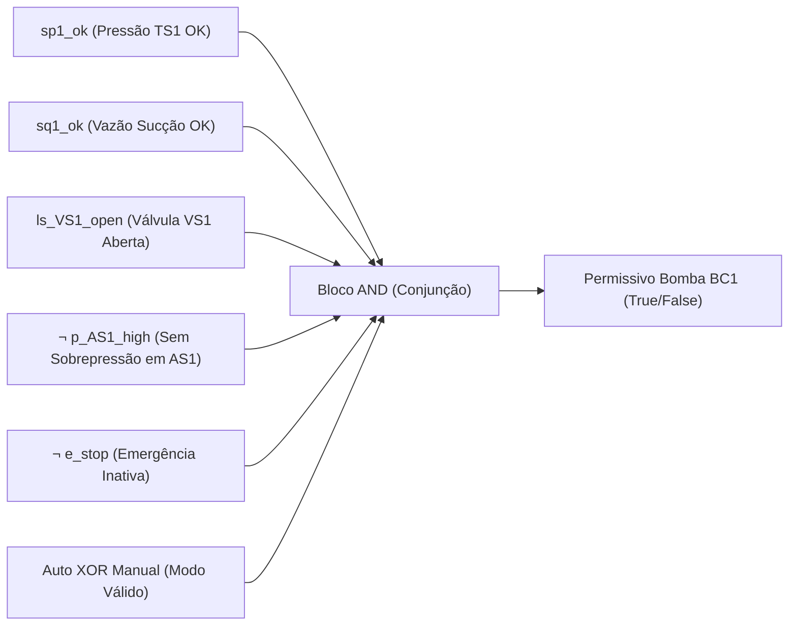

# Aula 04: Lógica Proposicional — Conectivos e Blocos de Permissivos

## 1. Fundamentos Matemáticos: Conectivos Lógicos

Na matemática discreta, uma proposição é uma sentença declarativa que assume um e apenas um valor-verdade: Verdadeiro ($1$) ou Falso ($0$).

Na automação de processos, esses valores correspondem diretamente a níveis lógicos em Controladores Lógicos Programáveis (CLP), contatos normalmente abertos/fechados (NA/NF) e estados de
variáveis digitais.

As operações sobre variáveis proposicionais são definidas por operadores lógicos fundamentais:
1. **Negação ($\neg A$ ou $\bar{A}$):** Inverte o valor-verdade da proposição. Em circuitos decontrole, modela contatos normalmente fechados (NF), estados de alarme e falhas ativas em nível lógico zero (fail-safe).
2. **Conjunção ($A \land B$):** Verdadeira se e somente se ambos os operandos forem verdadeiros. Em automação, modela circuitos e condições em série (cadeias de permissivos de segurança e intertravamentos de partida).
3. **Disjunção ($A \lor B$):** Verdadeira se ao menos um dos operandos for verdadeiro. Em automação, modela circuitos em paralelo, caminhos redundantes de segurança ou múltiplas condições de desligamento de emergência (Trips).
4. **Disjunção Exclusiva ($A \oplus B$):** Verdadeira se exatamente um dos operandos for verdadeiro ($\neg(A \leftrightarrow B)$). Utilizada obrigatoriamente na validação de seletores de modo operacional ($\text{Auto} \oplus \text{Manual}$).
5. **Implicação / Condicional ($A \rightarrow B$):** $\neg A \lor B$. Modela regras operacionais do tipo "SE condição $A$ for atendida, ENTÃO a ação $B$ éautorizada".
6. **Bicondicional ($A \leftrightarrow B$):** $(A \rightarrow B) \land (B \rightarrow A)$. Modela equivalência e sincronismo estrito entre comandos de atuadores e confirmações de sensores de fim de curso.

---

## 2. Aplicação em Engenharia: Permissivos e Intertravamentos do Sistema de Envasamento e Embalagem

Em sistemas automatizados de controle e supervisão (CLP), um **permissivo de partida** (*Start Permissive*) é uma condição booleana que deve ser estritamente satisfeita para que uma ação de comando (energização de bomba, acionamento de esteira ou disparo
de atuadores pneumáticos) seja executada.
A planta é composta pelos seguintes ativos e instrumentos principais:

- Logística: Esteira Transportadora ($\text{RC1}$).
- Suprimento e Envase: Reservatório Principal ($\text{TS1}$), Sensores de Pressão ($\text{SP1}$) e Vazão ($\text{SQ1}$), Válvula de Sucção ($\text{VS1}$), Bomba Centrífuga ($\text{BC1}$), Acumulador deSuprimento ($\text{AS1}$), Sensores pós-acumulador ($\text{SP2}$, $\text{SQ2}$) e Válvula de Enchimento ($\text{VS2}$).
- Inspeção de Nível: Válvula Solenoide ($\text{VS3}$) e Sensor de Nível ($\text{SL1}$).
- Tampagem: Válvula Solenoide ($\text{VS4}$) e Atuador de Capping ($\text{AC1}$).
- Inspeção de Vedação: Válvula Solenoide ($\text{VS5}$) e Sensor de Fim de Curso ($\text{SFC1}$).

### 2.1. Permissivo da Bomba Centrífuga de Alimentação ($P_{\text{BC1}}$)
A bomba centrífuga $\text{BC1}$ é responsável por transferir o fluido do reservatório principal $\text{TS1}$para o acumulador hidráulico $\text{AS1}$. Seu comando de partida ($cmd_{\text{BC1}}$) requer o atendimento conjunto das seguintes condições:

- Pressão na saída de $\text{TS1}$ dentro da faixa operacional: $sp_{1\_ok}$
- Vazão/disponibilidade de fluido na linha de sucção confirmada: $sq_{1\_ok}$Válvula solenoide de sucção totalmente aberta e confirmada: $ls_{\text{VS1\_open}}$
- Sem alarme de sobrepressão no acumulador $\text{AS1}$: $\neg p_{\text{AS1\_high}}$
- Botão de parada de emergência inativo: $\neg e_{\text{stop}}$
- Seleção exclusiva de modooperacional: $\text{Auto} \oplus \text{Manual}$

  $$P_{\text{BC1}} \equiv sp_{1\_ok} \land sq_{1\_ok} \land ls_{\text{VS1\_open}} \land \neg p_{\text{AS1\_high}} \land \neg e_{\text{stop}} \land (\text{Auto} \oplus \text{Manual})$$


### 2.2. Permissivos dos Módulos Operacionais da Linha

#### A. Permissivo da Esteira Transportadora ($P_{\text{RC1}}$)
A esteira $\text{RC1}$ só pode avançar se nenhuma estação estiver em ciclo de processo com ferramentas/atuadores estendidos:
$$P_{\text{RC1}} \equiv \neg \text{act}_{\text{VS2}} \land \neg \text{ext}_{\text{VS3}} \land \neg \text{ext}_{\text{VS4}} \land \neg \text{ext}_{\text{VS5}} \land \neg e_{\text{stop}} \land (\text{Auto} \oplus \text{Manual})$$

#### B. Permissivo da Válvula de Enchimento ($P_{\text{VS2}}$)
O envase pelo acumulador $\text{AS1}$ só é acionado com a garrafa posicionada sob o bico, a esteira parada e a pressão estável:
$$P_{\text{VS2}} \equiv s_{\text{pos\_VS2}} \land \neg cmd_{\text{RC1}} \land sp_{2\_ok} \land \neg e_{\text{stop}} \land (\text{Auto} \oplus \text{Manual})$$

#### C. Permissivo de Inspeção de Nível ($P_{\text{VS3}}$) e Tampagem ($P_{\text{VS4}}$)
O módulo de medição $\text{VS3}$ atua com esteira estática e garrafa presente. O módulo de colocação de tampa $\text{VS4}$ / $\text{AC1}$ requer adicionalmente a prévia aprovação do nível da garrafa:
$$P_{\text{VS3}} \equiv s_{\text{pos\_VS3}} \land \neg cmd_{\text{RC1}} \land \neg e_{\text{stop}} \land (\text{Auto} \oplus \text{Manual})$$
$$P_{\text{VS4}} \equiv s_{\text{pos\_VS4}} \land \text{Aprov}_{\text{Nível}} \land \neg cmd_{\text{RC1}} \land \neg e_{\text{stop}} \land (\text{Auto} \oplus \text{Manual})$$

#### D. Permissivo de Inspeção de Vedação ($P_{\text{VS5}}$)
A validação física da tampa pelo sensor de fim de curso $\text{SFC1}$ é condicionada por:
$$P_{\text{VS5}} \equiv s_{\text{pos\_VS5}} \land \neg cmd_{\text{RC1}} \land \neg e_{\text{stop}} \land (\text{Auto} \oplus \text{Manual})$$
$$\text{Aprov}_{\text{Vedação}} \equiv \text{ext}_{\text{VS5}} \land sfc_1$$

### 2.3. Intertrava de Bloqueio Contínuo (*Run Interlock* / Trip)
Mesmo após a partida, se qualquer condição crítica de processo falhar, a operação é desarmada instantaneamente.

Para a **Bomba Centrífuga $\text{BC1}$**:
$$\text{Trip}_{\text{BC1}} \equiv \neg sp_{1\_ok} \lor \neg sq_{1\_ok} \lor \neg ls_{\text{VS1\_open}} \lor p_{\text{AS1\_high}} \lor e_{\text{stop}}$$

Pelas **Leis de De Morgan**:
$$\text{Trip}_{\text{BC1}} \equiv \neg P_{\text{BC1\_base}}$$

Para a **Esteira Transportadora $\text{RC1}$**:
$$\text{Trip}_{\text{RC1}} \equiv e_{\text{stop}} \lor \text{act}_{\text{VS2}} \lor \text{ext}_{\text{VS3}} \lor \text{ext}_{\text{VS4}} \lor \text{ext}_{\text{VS5}}$$

---

## 3. Entregável da Aula 04

* **Algoritmo de Intertravamento Preliminar:** Implementação em Python dos blocos de permissivos e trips para a bomba $\text{BC1}$, esteira transportadora $\text{RC1}$, válvula de envase $\text{VS2}$, atuador de tampagem $\text{VS4/AC1}$ e módulos de inspeção ($\text{VS3/SL1}$ e $\text{VS5/SFC1}$), avaliando o vetor de estados da planta.

```python
"""
Aula 04: Lógica Proposicional — Conectivos e Blocos de Permissivos
Sistema: Linha Automatizada de Envasamento, Tampagem e Inspeção de Garrafas
"""

from typing import Dict, Any


def xor(a: bool, b: bool) -> bool:
    """Implementação formal do conectivo de Disjunção Exclusiva (XOR)."""
    return bool(a ^ b)


def avaliar_planta(estado: Dict[str, Any]) -> Dict[str, Any]:
    """
    Avalia os blocos de permissivos lógicos e intertravamentos de trip
    com base no vetor de variáveis proposicionais dos sensores e atuadores.
    """
    # 1. Modos de Operação e Segurança Geral
    modo_valido = xor(estado["modo_auto"], estado["modo_manual"])
    e_stop = estado["e_stop"]
    sem_emergencia = not e_stop

    # 2. Permissivo e Trip da Bomba Centrífuga BC1
    p_bc1_base = (
        estado["sp1_ok"]
        and estado["sq1_ok"]
        and estado["ls_vs1_open"]
        and not estado["p_as1_high"]
        and sem_emergencia
    )
    permissivo_bc1 = p_bc1_base and modo_valido
    trip_bc1 = (
        (not estado["sp1_ok"])
        or (not estado["sq1_ok"])
        or (not estado["ls_vs1_open"])
        or estado["p_as1_high"]
        or e_stop
    )

    # 3. Permissivo e Trip da Esteira Transportadora RC1
    bloqueio_mecanico = (
        estado["act_vs2"]
        or estado["ext_vs3"]
        or estado["ext_vs4"]
        or estado["ext_vs5"]
    )
    permissivo_rc1 = (not bloqueio_mecanico) and sem_emergencia and modo_valido
    trip_rc1 = e_stop or bloqueio_mecanico

    # 4. Permissivo da Válvula de Enchimento VS2
    permissivo_vs2 = (
        estado["pos_vs2"]
        and (not estado["cmd_rc1"])
        and estado["sp2_ok"]
        and sem_emergencia
        and modo_valido
    )

    # 5. Permissivo da Inspeção de Nível VS3 e Avaliação SL1
    permissivo_vs3 = (
        estado["pos_vs3"]
        and (not estado["cmd_rc1"])
        and sem_emergencia
        and modo_valido
    )
    aprov_nivel = estado["ext_vs3"] and estado["sl1_nivel_ok"]

    # 6. Permissivo de Tampagem VS4 (AC1)
    permissivo_vs4 = (
        estado["pos_vs4"]
        and estado["aprov_nivel_anterior"]
        and (not estado["cmd_rc1"])
        and sem_emergencia
        and modo_valido
    )

    # 7. Permissivo da Inspeção de Vedação VS5 e Avaliação SFC1
    permissivo_vs5 = (
        estado["pos_vs5"]
        and (not estado["cmd_rc1"])
        and sem_emergencia
        and modo_valido
    )
    aprov_vedacao = estado["ext_vs5"] and estado["sfc1_tampa_detectada"]

    return {
        "Modo_Valido": modo_valido,
        "P_BC1 (Bomba)": permissivo_bc1,
        "Trip_BC1": trip_bc1,
        "P_RC1 (Esteira)": permissivo_rc1,
        "Trip_RC1": trip_rc1,
        "P_VS2 (Envase)": permissivo_vs2,
        "P_VS3 (Insp. Nível)": permissivo_vs3,
        "Aprov_Nivel": aprov_nivel,
        "P_VS4 (Tampagem)": permissivo_vs4,
        "P_VS5 (Insp. Vedação)": permissivo_vs5,
        "Aprov_Vedacao": aprov_vedacao,
    }


if __name__ == "__main__":
    cenario_nominal = {
        "modo_auto": True,
        "modo_manual": False,
        "e_stop": False,
        "sp1_ok": True,
        "sq1_ok": True,
        "ls_vs1_open": True,
        "p_as1_high": False,
        "sp2_ok": True,
        "cmd_rc1": False,
        "act_vs2": False,
        "ext_vs3": False,
        "ext_vs4": False,
        "ext_vs5": False,
        "pos_vs2": True,
        "pos_vs3": False,
        "pos_vs4": False,
        "pos_vs5": False,
        "sl1_nivel_ok": False,
        "aprov_nivel_anterior": True,
        "sfc1_tampa_detectada": False,
    }

    resultado = avaliar_planta(cenario_nominal)
    print("=" * 60)
    print("ESTADO DOS PERMISSIVOS E INTERTRAVAMENTOS")
    print("=" * 60)
    for chave, valor in resultado.items():
        print(f"{chave:<25}: {str(valor):<6}")
```


