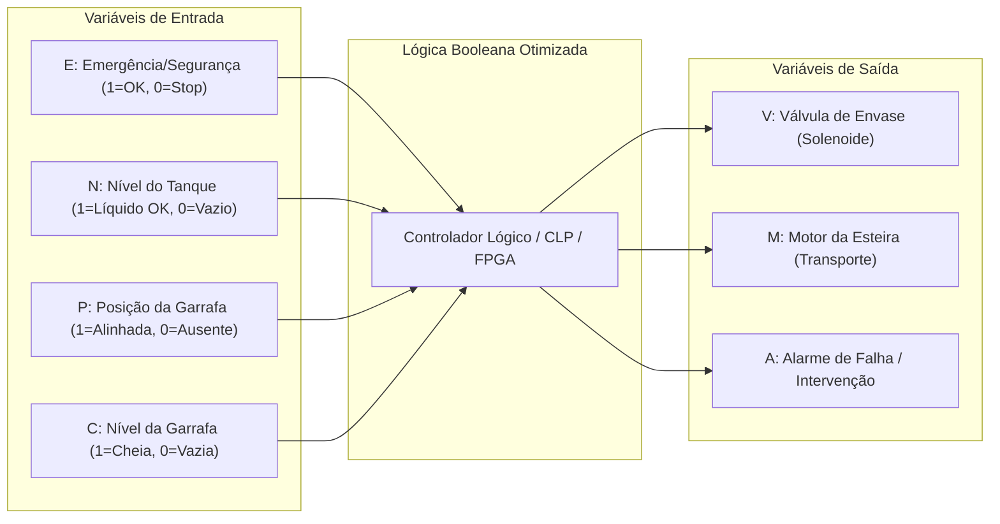

# Parte 05: Formas Normais e Otimização Booleana
**Projeto Integrador / Disciplina:** Matemática Discreta e Sistemas Digitais  
**Curso:** Engenharia de Controle e Automação (ECA)  
**Sistema:** Linha Automatizada de Envasamento de Bebidas  
**Repositório:** [Grupo 3 - ECA A08](https://github.com/GuiCastro7/Grupo-3---ECAA08.git)

---

## 1. Introdução e Contextualização do Processo de Envase

Na automação de uma planta industrial de envasamento de bebidas (sucos, refrigerantes ou água mineral), a tomada de decisão em tempo real sobre os atuadores é regida por controladores digitais (CLPs, microcontroladores ou CPLDs/FPGAs). Para assegurar **segurança operacional (Norma NR-12 / SIL)**, **eficiência energética** e **velocidade de resposta (*scan time*)**, as regras de acionamento devem ser formalizadas por meio de **Álgebra Booleana** e **Matemática Discreta**, convertidas em suas **Formas Normais** e posteriormente **otimizadas**.

A célula de envasamento considerada neste módulo é composta por:
1. **Esteira Transportadora:** Conduz as garrafas até o posto de dosagem.
2. **Estação de Dosagem / Bico Injetor:** Composta por válvula solenoide proporcional/ON-OFF.
3. **Reservatório de Bebida (Tanque Principal):** Armazena o fluido com controle de nível.
4. **Circuito de Segurança / Intertravamento:** Botão de parada de emergência e sensores de proteção de barreira óptica.



---

## 2. Definição Formal das Variáveis Proposicionais

Mapeamos o comportamento físico dos sensores e atuadores do posto de envasamento em um espaço vetorial booleano $\mathbb{B}^4 \to \mathbb{B}^3$, onde $\mathbb{B} = \{0, 1\}$.

### 2.1 Variáveis de Entrada (Sensores)

| Variável | Significado Físico / Sensor | Estado Lógico `0` | Estado Lógico `1` |
| :---: | :--- | :--- | :--- |
| **$E$** | Circuito de Parada de Emergência / Intertravamento | Emergência Ativada / Inseguro (STOP) | Condição Segura / Habilitado (RUN) |
| **$N$** | Sensor de Nível do Tanque Principal de Bebida | Tanque Vazio / Abaixo do Mínimo | Tanque com Líquido Suficiente |
| **$P$** | Sensor Fotoelétrico de Presença / Posição da Garrafa | Sem garrafa no bico de envase | Garrafa alinhada sob o bico |
| **$C$** | Sensor de Conclusão de Enchimento da Garrafa | Garrafa vazia / Em enchimento | Garrafa cheia (Volume nominal atingido) |

> **Convenção de Ordem Binária:** Adotamos o vetor de estados ordenado do bit mais significativo (MSB) para o menos significativo (LSB):  
> $$\mathbf{X} = (E, N, P, C)_2 \implies \text{Índice decimal } i = 8E + 4N + 2P + 1C \in [0, 15]$$

---

### 2.2 Variáveis de Saída (Atuadores)

| Atuador | Descrição Funcional | Condição de Acionamento (`1`) |
| :---: | :--- | :--- |
| **$V$** | **Válvula Solenoide de Envase** | Abre apenas se o sistema estiver seguro ($E=1$), o tanque tiver bebida ($N=1$), houver garrafa posicionada ($P=1$) e a garrafa **não** estiver cheia ($C=0$). |
| **$M$** | **Motor da Esteira de Transporte** | Move a esteira se o sistema estiver seguro ($E=1$) **E** (não houver garrafa no posto, $P=0$, **OU** a garrafa atual já terminou de envasar, $C=1$). A esteira para durante o enchimento ($P=1 \land C=0$) ou em emergência. |
| **$A$** | **Sinalizador de Alarme / Falha** | Dispara se a emergência for acionada ($E=0$) **OU** se houver garrafa aguardando enchimento ($P=1 \land C=0$), porém o tanque principal estiver vazio ($N=0$). |

---

## 3. Tabela-Verdade Global do Sistema de Envasamento

Avaliando as regras do processo para todos os $2^4 = 16$ arranjos possíveis de entradas:

| Índice ($m_i$) | $E$ | $N$ | $P$ | $C$ | $V$ (Válvula) | $M$ (Motor) | $A$ (Alarme) | Diagnóstico Operacional do Sistema |
| :---: | :---: | :---: | :---: | :---: | :---: | :---: | :---: | :--- |
| **$m_0$** | `0` | `0` | `0` | `0` | `0` | `0` | `1` | Emergência acionada (Parada total + Alarme) |
| **$m_1$** | `0` | `0` | `0` | `1` | `0` | `0` | `1` | Emergência acionada (Parada total + Alarme) |
| **$m_2$** | `0` | `0` | `1` | `0` | `0` | `0` | `1` | Emergência acionada (Parada total + Alarme) |
| **$m_3$** | `0` | `0` | `1` | `1` | `0` | `0` | `1` | Emergência acionada (Parada total + Alarme) |
| **$m_4$** | `0` | `1` | `0` | `0` | `0` | `0` | `1` | Emergência acionada (Parada total + Alarme) |
| **$m_5$** | `0` | `1` | `0` | `1` | `0` | `0` | `1` | Emergência acionada (Parada total + Alarme) |
| **$m_6$** | `0` | `1` | `1` | `0` | `0` | `0` | `1` | Emergência acionada (Parada total + Alarme) |
| **$m_7$** | `0` | `1` | `1` | `1` | `0` | `0` | `1` | Emergência acionada (Parada total + Alarme) |
| **$m_8$** | `1` | `0` | `0` | `0` | `0` | `1` | `0` | Habilitado; Esteira busca garrafa; Tanque baixo |
| **$m_9$** | `1` | `0` | `0` | `1` | `0` | `1` | `0` | Habilitado; Esteira transporta garrafa cheia |
| **$m_{10}$**| `1` | `0` | `1` | `0` | `0` | `0` | `1` | **Falha de Insumo:** Garrafa no posto mas tanque vazio! |
| **$m_{11}$**| `1` | `0` | `1` | `1` | `0` | `1` | `0` | Garrafa cheia no posto; Esteira avança para evacuar |
| **$m_{12}$**| `1` | `1` | `0` | `0` | `0` | `1` | `0` | Normal; Esteira transporta garrafa até o bico |
| **$m_{13}$**| `1` | `1` | `0` | `1` | `0` | `1` | `0` | Normal; Esteira transporta garrafa cheia adiante |
| **$m_{14}$**| `1` | `1` | `1` | `0` | **`1`** | `0` | `0` | **PROCESSO DE ENVASE ATIVO:** Válvula aberta, esteira travada |
| **$m_{15}$**| `1` | `1` | `1` | `1` | `0` | `1` | `0` | Envase concluído; Esteira reinicia avanço |

---

## 4. Formas Normais Canônicas

Na matemática discreta, toda função booleana $f: \mathbb{B}^n \to \mathbb{B}$ pode ser expressa univocamente por meio de suas formas canônicas baseadas nos conjuntos de **Mintermos** ($\mathcal{S}_{on} = \{i \mid f(i) = 1\}$) e **Maxtermos** ($\mathcal{S}_{off} = \{j \mid f(j) = 0\}$).

### 4.1 Forma Normal Disjuntiva Canônica (FND / Soma de Mintermos - SOP)

A FND Canônica é a disjunção lógica ($\lor$ ou $+$) de todos os mintermos em que a função assume valor $1$:
$$f(\mathbf{X}) = \bigvee_{i \in \mathcal{S}_{on}} m_i(\mathbf{X})$$

#### A) Válvula de Envase ($V$):
* **Mintermos:** $\mathcal{S}_{on}(V) = \{14\}$
$$\boxed{V_{\text{FND}} = m_{14} = E \cdot N \cdot P \cdot \bar{C}}$$

#### B) Motor da Esteira ($M$):
* **Mintermos:** $\mathcal{S}_{on}(M) = \{8, 9, 11, 12, 13, 15\}$
$$M_{\text{FND}} = m_8 + m_9 + m_{11} + m_{12} + m_{13} + m_{15}$$
$$\boxed{M_{\text{FND}} = (E \bar{N} \bar{P} \bar{C}) + (E \bar{N} \bar{P} C) + (E \bar{N} P C) + (E N \bar{P} \bar{C}) + (E N \bar{P} C) + (E N P C)}$$

#### C) Alarme de Falha ($A$):
* **Mintermos:** $\mathcal{S}_{on}(A) = \{0, 1, 2, 3, 4, 5, 6, 7, 10\}$
$$A_{\text{FND}} = \sum m(0, 1, 2, 3, 4, 5, 6, 7, 10)$$
$$\begin{aligned}
A_{\text{FND}} = & (\bar{E}\bar{N}\bar{P}\bar{C}) + (\bar{E}\bar{N}\bar{P}C) + (\bar{E}\bar{N}P\bar{C}) + (\bar{E}\bar{N}PC) \\
& + (\bar{E}N\bar{P}\bar{C}) + (\bar{E}N\bar{P}C) + (\bar{E}NP\bar{C}) + (\bar{E}NPC) + (E\bar{N}P\bar{C})
\end{aligned}$$

---

### 4.2 Forma Normal Conjuntiva Canônica (FNC / Produto de Maxtermos - POS)

A FNC Canônica é a conjunção lógica ($\land$ ou $\cdot$) de todos os maxtermos em que a função assume valor $0$:
$$f(\mathbf{X}) = \bigwedge_{j \in \mathcal{S}_{off}} M_j(\mathbf{X})$$

#### A) Válvula de Envase ($V$):
* **Maxtermos:** $\mathcal{S}_{off}(V) = \{0, 1, 2, 3, 4, 5, 6, 7, 8, 9, 10, 11, 12, 13, 15\}$
$$\boxed{V_{\text{FNC}} = \prod M(0, 1, 2, 3, 4, 5, 6, 7, 8, 9, 10, 11, 12, 13, 15)}$$

#### B) Motor da Esteira ($M$):
* **Maxtermos:** $\mathcal{S}_{off}(M) = \{0, 1, 2, 3, 4, 5, 6, 7, 10, 14\}$
$$\boxed{M_{\text{FNC}} = \prod M(0, 1, 2, 3, 4, 5, 6, 7, 10, 14)}$$
Expandindo os maxtermos:
$$\begin{aligned}
M_{\text{FNC}} = & (E+N+P+C)(E+N+P+\bar{C})(E+N+\bar{P}+C)(E+N+\bar{P}+\bar{C}) \\
& \cdot (E+\bar{N}+P+C)(E+\bar{N}+P+\bar{C})(E+\bar{N}+\bar{P}+C)(E+\bar{N}+\bar{P}+\bar{C}) \\
& \cdot (\bar{E}+N+\bar{P}+C)(\bar{E}+\bar{N}+\bar{P}+C)
\end{aligned}$$

#### C) Alarme de Falha ($A$):
* **Maxtermos:** $\mathcal{S}_{off}(A) = \{8, 9, 11, 12, 13, 14, 15\}$
$$\boxed{A_{\text{FNC}} = \prod M(8, 9, 11, 12, 13, 14, 15)}$$

---

## 5. Métodos de Otimização e Simplificação Booleana

### 5.1 Método 1: Simplificação Algébrica (Teoremas da Álgebra de Boole)

Utilizamos os axiomas e teoremas fundamentais:
* **Adjacência Lógica:** $x \cdot y + x \cdot \bar{y} = x(y + \bar{y}) = x \cdot 1 = x$
* **Distributividade:** $x + (y \cdot z) = (x + y)(x + z)$
* **Teoremas de De Morgan:** $\overline{x + y} = \bar{x} \cdot \bar{y}$ e $\overline{x \cdot y} = \bar{x} + \bar{y}$
* **Absorção e Redução:** $x + \bar{x}y = x + y$

#### Simplificação Algébrica do Motor da Esteira ($M$):
Partindo da FND Canônica:
$$M = E\bar{N}\bar{P}\bar{C} + E\bar{N}\bar{P}C + E\bar{N}PC + EN\bar{P}\bar{C} + EN\bar{P}C + ENPC$$

1. Fatorando $E$ em todos os termos:
   $$M = E \left[ \bar{N}\bar{P}(\bar{C} + C) + \bar{N}PC + N\bar{P}(\bar{C} + C) + NPC \right]$$
2. Como $\bar{C} + C = 1$:
   $$M = E \left[ \bar{N}\bar{P} + \bar{N}PC + N\bar{P} + NPC \right]$$
3. Agrupando os termos em $\bar{P}$ e em $PC$:
   $$M = E \left[ \bar{P}(\bar{N} + N) + PC(\bar{N} + N) \right]$$
4. Como $\bar{N} + N = 1$:
   $$M = E \left[ \bar{P} + PC \right]$$
5. Aplicando a regra de eliminação por absorção ($\bar{P} + PC = \bar{P} + C$):
   $$\boxed{M_{\text{Mínima}} = E \cdot (\bar{P} + C) = E\bar{P} + EC}$$

#### Simplificação Algébrica do Alarme ($A$):
Partindo de $A_{\text{FND}} = \sum m(0..7) + m_{10}$:
1. A soma dos mintermos $0$ a $7$ cobre todos os estados onde $E=0$:
   $$\sum_{i=0}^{7} m_i = \bar{E}\bar{N}\bar{P}\bar{C} + \dots + \bar{E}NPC = \bar{E}$$
2. O mintermo restante é $m_{10} = E\bar{N}P\bar{C}$.
3. Somando: $A = \bar{E} + E\bar{N}P\bar{C}$.
4. Aplicando a propriedade $x + \bar{x}y = x + y$, onde $x = \bar{E}$ e $\bar{x} = E$:
   $$\boxed{A_{\text{Mínima}} = \bar{E} + \bar{N}P\bar{C}}$$

---

### 5.2 Método 2: Mapas de Karnaugh (K-Maps) de 4 Variáveis

A representação matricial com adjacência em **Código Gray** ($00, 01, 11, 10$) permite a identificação geométrica direta dos implicantes primos essenciais.

#### A) Mapa de Karnaugh para o Motor da Esteira ($M$):
Linhas: $EN$, Colunas: $PC$

```
EN \ PC |  00   01   11   10  |
--------+---------------------+
  00    |   0    0    0    0  |
  01    |   0    0    0    0  |
  11    |  [1]  [1]  [1]   0  |  <- Grupo 1 (EN=11, PC=00,01) + Grupo 2 (EN=11, PC=01,11)
  10    |  [1]  [1]  [1]   0  |  <- Grupo 1 (EN=10, PC=00,01) + Grupo 2 (EN=10, PC=01,11)
```

* **Grupo 1 (Azul - $4$ células):** Colunas $PC=00, 01$ nas linhas $EN=11, 10$.  
  $N$ varia ($0 \to 1$), $C$ varia ($0 \to 1$). Termo resultante: $\mathbf{E\bar{P}}$.
* **Grupo 2 (Verde - $4$ células):** Colunas $PC=01, 11$ nas linhas $EN=11, 10$.  
  $N$ varia ($0 \to 1$), $P$ varia ($0 \to 1$). Termo resultante: $\mathbf{EC}$.
* **Expressão Mínima SOP:** $\mathbf{M = E\bar{P} + EC = E(\bar{P} + C)}$.

---

#### B) Mapa de Karnaugh para o Alarme ($A$):
Linhas: $EN$, Colunas: $PC$

```
EN \ PC |  00   01   11   10  |
--------+---------------------+
  00    |  [1]  [1]  [1]  [1] |  <- Octeto Superior: E = 0 (m0 a m7)
  01    |  [1]  [1]  [1]  [1] |
  11    |   0    0    0    0  |
  10    |   0    0    0   [1] |  <- m10 (1010) agrupa com m2 (0010)
```

* **Grupo 1 (Octeto - $8$ células):** Todas as células das linhas $EN=00$ e $EN=01$.  
  Termo resultante: $\mathbf{\bar{E}}$.
* **Grupo 2 (Par - $2$ células):** Célula $m_{10}$ ($1010$) agrupa com $m_2$ ($0010$).  
  $E$ varia ($0 \to 1$), fixando $N=0, P=1, C=0$. Termo resultante: $\mathbf{\bar{N}P\bar{C}}$.
* **Expressão Mínima SOP:** $\mathbf{A = \bar{E} + \bar{N}P\bar{C}}$.

---

### 5.3 Método 3: Algoritmo Tabular de Quine-McCluskey e Petrick

O método de Quine-McCluskey é a abordagem sistemática perfeita para implementação algorítmica computacional.

#### Passo 1: Agrupamento por Peso de Hamming ($W = \text{contagem de bits '1'}$):
Exemplo para a função $M = \sum m(8, 9, 11, 12, 13, 15)$:

* **Grupo 1 ($W=1$):**
  * $m_8 = 1000$
* **Grupo 2 ($W=2$):**
  * $m_9 = 1001$
  * $m_{12} = 1100$
* **Grupo 3 ($W=3$):**
  * $m_{11} = 1011$
  * $m_{13} = 1101$
* **Grupo 4 ($W=4$):**
  * $m_{15} = 1111$

#### Passo 2: Combinação de Termos Adjacentes (Diferença de 1 bit):
* **Combinações de Ordem 1 ($1$ hífen `-`):**
  * $(m_8, m_9) \implies 100-$
  * $(m_8, m_{12}) \implies 1-00$
  * $(m_9, m_{11}) \implies 10-1$
  * $(m_9, m_{13}) \implies 1-01$
  * $(m_{12}, m_{13}) \implies 110-$
  * $(m_{11}, m_{15}) \implies 1-11$
  * $(m_{13}, m_{15}) \implies 11-1$

* **Combinações de Ordem 2 ($2$ hífens `--`):**
  * $(m_8, m_9, m_{12}, m_{13}) \implies \mathbf{1--0 \implies E\bar{P}}$ (Implicante Primo)
  * $(m_9, m_{11}, m_{13}, m_{15}) \implies \mathbf{1--1 \implies EC}$ (Implicante Primo)

#### Passo 3: Quadro de Cobertura de Implicantes Primos:

| Implicante Primo | Termo Booleano | $m_8$ | $m_9$ | $m_{11}$ | $m_{12}$ | $m_{13}$ | $m_{15}$ | Essencial? |
| :--- | :---: | :---: | :---: | :---: | :---: | :---: | :---: | :---: |
| $P_1 = (8, 9, 12, 13)$ | $E\bar{P}$ | **$\times$** | $\times$ | | **$\times$** | $\times$ | | **SIM** (Único a cobrir $m_8, m_{12}$) |
| $P_2 = (9, 11, 13, 15)$| $EC$ | | $\times$ | **$\times$** | | $\times$ | **$\times$** | **SIM** (Único a cobrir $m_{11}, m_{15}$) |

Ambos são **Implicantes Primos Essenciais (EPI)**, resultando na cobertura mínima:
$$\mathbf{M = E\bar{P} + EC}$$

---

## 6. Comparativo Quantitativo de Custo e Eficiência

Para quantificar o ganho de engenharia da otimização booleana em projetos de hardware digital e automação:

| Função Lógica | Métrica | Forma Canônica (FND) | Forma Mínima Otimizada | Redução Percentual |
| :--- | :--- | :---: | :---: | :---: |
| **Válvula ($V$)** | Literais | 4 | 4 | **0%** (Já irredutível) |
| | Portas Lógicas | 1 AND (4 entradas) + 1 NOT | 1 AND (4 entradas) + 1 NOT | 0% |
| **Motor ($M$)** | Literais | 24 | 3 | **$\mathbf{87.5\%}$ de redução!** |
| | Portas Lógicas | 6 ANDs + 1 OR + 12 NOTs | 1 AND + 1 OR + 1 NOT | **$\mathbf{78.9\%}$ de redução!** |
| **Alarme ($A$)** | Literais | 36 | 4 | **$\mathbf{88.9\%}$ de redução!** |
| | Portas Lógicas | 9 ANDs + 1 OR + 21 NOTs | 1 AND + 1 OR + 3 NOTs | **$\mathbf{84.0\%}$ de redução!** |

### Benefícios Diretos em Controle e Automação:
1. **Tempo de Varredura do CLP (*Scan Time*):** A avaliação de $3$ literais contra $24$ consome menos ciclos de clock da CPU do CLP.
2. **Confiabilidade e Segurança:** Circuitos menores apresentam menor taxa de falha de componentes ($MTBF$ superior) e menor dissipação térmica.
3. **Eliminação de *Hazards* / *Glitches*:** A minimização correta impede transitórios espúrios durante as comutações de sensores ópticos e indutivos na esteira.

---

## 7. Implementação Industrial: Diagrama Ladder e Texto Estruturado

### 7.1 Código em Texto Estruturado (IEC 61131-3 Structured Text)

```pascal
PROGRAM PostoEnvasamento_Controle
VAR_INPUT
    E : BOOL; (* Chave de Emergência / Intertravamento de Segurança (1 = OK) *)
    N : BOOL; (* Sensor de Nível do Tanque Principal (1 = Nível OK) *)
    P : BOOL; (* Sensor Fotoelétrico de Presença de Garrafa (1 = Alinhada) *)
    C : BOOL; (* Sensor de Garrafa Cheia / Envase Concluído (1 = Cheia) *)
END_VAR

VAR_OUTPUT
    V : BOOL; (* Válvula Solenoide de Envase *)
    M : BOOL; (* Motor da Esteira de Transporte *)
    A : BOOL; (* Sinalizador de Falha / Alarme *)
END_VAR

// 1. Acionamento da Válvula de Envase (V = E . N . P . NOT C)
V := E AND N AND P AND (NOT C);

// 2. Acionamento do Motor da Esteira (M = E . (NOT P OR C))
M := E AND ((NOT P) OR C);

// 3. Acionamento do Alarme de Segurança / Falha (A = NOT E OR (NOT N . P . NOT C))
A := (NOT E) OR ((NOT N) AND P AND (NOT C));

END_PROGRAM
```

---

### 7.2 Diagrama Ladder Equivalente (IEC 61131-3 LD)

#### Linha 1: Válvula de Envase ($V$)
```
   E        N        P        C            V
--[ ]------[ ]------[ ]------[/]----------( )--
```

#### Linha 2: Motor da Esteira ($M$)
```
   E           P                           M
--[ ]----+----[/]----+--------------------( )--
         |           |
         |     C     |
         +----[ ]----+
```

#### Linha 3: Sinalizador de Alarme / Falha ($A$)
```
   E                                       A
--[/]----+--------------------------------( )--
         |
         |     N        P        C       |
         +----[/]------[ ]------[/]------+
```

---

## 8. Conclusão

A aplicação rigorosa dos conceitos de **Formas Normais (FND e FNC)**, **Mapas de Karnaugh** e do **Algoritmo de Quine-McCluskey** sobre o posto de envasamento de bebidas demonstrou que a modelagem matemática discreta é a espinha dorsal de sistemas industriais confiáveis. A redução de mais de **$87\%$ no número de literais** traduz-se diretamente em menor custo de hardware, menor suscetibilidade a falhas e código otimizado para controladores lógicos programáveis.
