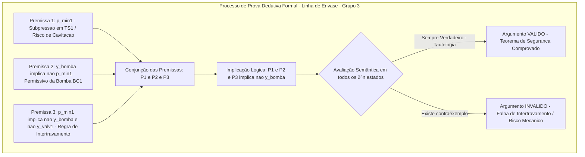

# Aula 07: Validade de Argumentos e Inferência Lógica na Segurança de Processos

**Projeto Integrador / Disciplina:** Matemática Discreta e Sistemas Digitais  
**Curso:** Engenharia de Controle e Automação (ECA)  
**Sistema:** Linha Automatizada de Envasamento e Tampamento de Bebidas  
**Grupo:** Grupo 3 — ECAA08  

---

## 1. Fundamentos Matemáticos: Argumentos Dedutivos, Validade e Tautologias

Na engenharia de controle e automação voltada à segurança funcional de processos industriais (*Safety Instrumented Systems - SIS* / normas IEC 61511, IEC 61508 e NR-12), a tomada de decisão crítica de intertravamento de segurança (*Safety Interlock*) e parada de emergência (*Emergency Shutdown - ESD / Trip*) não pode se apoiar em inferências empíricas ou indutivas. Ela deve ser fundamentada na **Validade Lógica Dedutiva**.

### 1.1. Definição Formal de Argumento e Validade

Um **argumento dedutivo** é uma estrutura formal composta por uma sequência finita de premissas $\{P_1, P_2, \dots, P_k\}$ (que expressam regras de intertravamento do CLP e leituras de sensores) e uma conclusão $C$ (ação de controle ou comando de atuador), denotado por:

$$P_1, P_2, \dots, P_k \vdash C$$

Diz-se que o argumento é **semanticamente válido** (denotado por $P_1, P_2, \dots, P_k \models C$) se e somente se for **logicamente impossível** que todas as premissas sejam simultaneamente verdadeiras e a conclusão seja falsa. 

Pelo **Teorema da Dedução**, a validade de um argumento dedutivo é logicamente equivalente a demonstrar que a implicação da conjunção das premissas sobre a conclusão é uma **Tautologia ($\top$)**:

$$\{P_1, P_2, \dots, P_k\} \models C \quad \iff \quad (P_1 \land P_2 \land \dots \land P_k) \rightarrow C \equiv \mathbf{T}$$

Se existir ao menos um estado lógico (valoração booleana) no qual todas as premissas são verdadeiras ($\mathbf{V}$), mas a conclusão é falsa ($\mathbf{F}$), o argumento é classificado como **INVÁLIDO / FALÁCIA**, representando uma vulnerabilidade crítica de projeto ou brecha de segurança no código do controlador.

---

## 2. Tabela de Regras Canônicas de Inferência Lógica Aplicadas à Linha de Envase

As regras de inferência são esquemas sintáticos de transformação válidos que preservam a verdade. Quando incorporadas na arquitetura do software do CLP e do sistema supervisório (SCADA), garantem que qualquer decisão de comando e intertravamento seja matematicamente correta.

A tabela a seguir apresenta os esquemas canônicos de inferência adaptados às tags, sensores e atuadores da **Linha de Envasamento de Bebidas (Grupo 3)**:

| Regra de Inferência | Esquema Formal | Aplicação na Linha de Envase e Tampamento (Grupo 3) |
| :--- | :---: | :--- |
| **Modus Ponens (MP)** | $\dfrac{P \rightarrow Q, \quad P}{\therefore Q}$ | **Regra:** Se ocorrer subpressão crítica em TS1 ($p_{mín1} < 1,0\,\text{Barg}$), desligue a bomba centrífuga BC1 ($\neg y_{bomba}$). **Fato:** O sensor SP1 registrou $0,7\,\text{Barg}$ ($p_{mín1} = \mathbf{V}$). **Conclusão:** Desarmar imediatamente a bomba BC1 ($\neg y_{bomba}$). |
| **Modus Tollens (MT)** | $\dfrac{P \rightarrow Q, \quad \neg Q}{\therefore \neg P}$ | **Regra:** Se a válvula solenoide de envase VS2 estiver aberta ($y_{válv2}$), o medidor SQ2 detecta fluxo positivo ($q_{flx2}$). **Fato:** O sensor SQ2 detecta fluxo nulo ($\neg q_{flx2}$). **Conclusão:** A válvula VS2 não abriu ($\neg y_{válv2}$) $\to$ Diagnóstico de falha mecânica/queima de bobina da VS2. |
| **Silogismo Hipotético (SH)** | $\dfrac{P \rightarrow Q, \quad Q \rightarrow R}{\therefore P \rightarrow R}$ | **Premissa 1:** Sobrepressão no acumulador AS1 ($p_{máx2}$) implica corte da dosagem na válvula VS2 ($\neg y_{válv2}$). **Premissa 2:** Corte da dosagem ($\neg y_{válv2}$) implica parada preventiva da esteira RC1 ($\neg cmd_{RC1}$). **Conclusão:** Sobrepressão em AS1 ($p_{máx2}$) implica parada preventiva da esteira RC1 ($\neg cmd_{RC1}$). |
| **Silogismo Disjuntivo (SD)** | $\dfrac{P \lor Q, \quad \neg P}{\therefore Q}$ | **Premissa 1:** A pressurização do sistema de envase é provida pela Bomba Principal BC1 ($y_{bomba}$) ou pela Linha Auxiliar AS1 ($y_{aux}$). **Premissa 2:** A bomba BC1 desarmou por alarme térmico ($\neg y_{bomba}$). **Conclusão:** Ativar pressurização pela Linha Auxiliar AS1 ($y_{aux}$). |
| **Resolução Proposicional** | $\dfrac{P \lor Q, \quad \neg P \lor R}{\therefore Q \lor R}$ | **Premissa 1:** Sobrepressão em SP1 ($p_{máx1}$) ou Emergência acionada ($e_{stop}$). **Premissa 2:** Sem sobrepressão em SP1 ($\neg p_{máx1}$) ou Desarme geral da linha ($trip_{geral}$). **Conclusão:** Emergência acionada ($e_{stop}$) ou Desarme geral da linha ($trip_{geral}$). |
| **Dilema Construtivo (DC)** | $\dfrac{(P \rightarrow Q) \land (R \rightarrow S), \quad P \lor R}{\therefore Q \lor S}$ | **Premissa 1:** Se sobrepressão em SP1 ($p_{máx1}$), abrir alívio ($y_{psv}$); se vazão excessiva em SQ1 ($q_{máx1}$), estrangular sucção ($y_{est}$). **Premissa 2:** Ocorreu sobrepressão ou vazão excessiva ($p_{máx1} \lor q_{máx1}$). **Conclusão:** Abrir alívio ($y_{psv}$) ou estrangular sucção ($y_{est}$). |

---

## 3. Teorema da Refutação e Prova por Contradição (*Reductio ad Absurdum*)

Na verificação formal automatizada por provadores de teoremas e solucionadores de satisfatibilidade booleana (**SAT Solvers** / *Z3*, *MiniSat*), a validade do argumento $P_1, P_2, \dots, P_k \vdash C$ é demonstrada pelo **método de refutação**.

### 3.1. Formulação do Teorema da Refutação

Um conjunto de premissas acarreta logicamente uma conclusão se e somente se a conjunção das premissas com a **negação da conclusão** for **insatisfatível** (uma contradição estrita $\mathbf{F}$):

$$\{P_1, P_2, \dots, P_k, \neg C\} \models \mathbf{F} \quad (\text{Insatisfatível / Contradição } \bot)$$

### 3.2. Demonstração Analítica para o Intertravamento da Bomba BC1

Vamos provar por contradição a regra de segurança que impede a operação da bomba $BC1$ sob risco de cavitação em $TS1$:

* **Premissa 1 ($P_1$):** Regra de intertravamento: $p_{mín1} \rightarrow \neg y_{bomba} \equiv \neg p_{mín1} \lor \neg y_{bomba}$
* **Premissa 2 ($P_2$):** Leitura de subpressão ativa: $p_{mín1}$
* **Conclusão ($C$):** Desarme da bomba: $\neg y_{bomba}$

Para refutar, assume-se hipoteticamente que a conclusão é falsa, ou seja, $\neg C \equiv \neg(\neg y_{bomba}) \equiv y_{bomba}$ (a bomba permanece ligada):

$$\Phi_{\text{refutação}} = P_1 \land P_2 \land \neg C = (\neg p_{mín1} \lor \neg y_{bomba}) \land p_{mín1} \land y_{bomba}$$

Aplicando a distributividade da conjunção sobre a disjunção:

$$\Phi_{\text{refutação}} = \big(\neg p_{mín1} \land p_{mín1} \land y_{bomba}\big) \lor \big(\neg y_{bomba} \land p_{mín1} \land y_{bomba}\big)$$

Pela lei da não-contradição ($\alpha \land \neg \alpha \equiv \mathbf{F}$):

$$\Phi_{\text{refutação}} = \big(\mathbf{F} \land y_{bomba}\big) \lor \big(\mathbf{F} \land p_{mín1}\big) = \mathbf{F} \lor \mathbf{F} \equiv \mathbf{F} \quad (\text{Insatisfatível})$$

> **Conclusão da Prova:** Como o conjunto $\{P_1, P_2, \neg C\}$ é insatisfatível ($\bot$), o argumento original é **incondicionalmente válido**, provando matematicamente que o intertravamento impede falha mecânica da bomba.

---

## 4. Falácias Formais Comuns em Projetos de Automação Industrial

A distinção entre argumentos válidos e falácias lógicas é vital. Erros de raciocínio falacioso implementados na lógica de controle de CLPs podem gerar acidentes com danos a equipamentos e risco à integridade física dos operadores.

### 4.1. Falácia da Afirmação do Consequente
$$P \rightarrow Q, \; Q \not\vdash P$$

* **Exemplo Errôneo no Envase:**  
  "Se a pressão na sucção cair abaixo de 1,0 Barg ($p_{mín1}$), a bomba centrífuga BC1 é desarmada ($\neg y_{bomba}$). O sistema supervisório detectou que a bomba BC1 está desligada ($\neg y_{bomba}$). Logo, a pressão na sucção está abaixo de 1,0 Barg ($p_{mín1}$)."
* **Análise de Invalidade:**  
  O argumento é **INVÁLIDO**. A bomba BC1 pode estar desligada por comando manual do operador, por parada programada de manutenção, por atuação do botão de emergência ($e_{stop}$) ou pelo fato de o acumulador AS1 já ter atingido o nível/pressão máxima. A afirmação do consequente gera alarmes falsos de instrumentação no SCADA.

### 4.2. Falácia da Negação do Antecedente
$$P \rightarrow Q, \; \neg P \not\vdash \neg Q$$

* **Exemplo Errôneo no Envase:**  
  "Se o botão de emergência for pressionado ($e_{stop}$), feche imediatamente a válvula solenoide de envase VS2 ($\neg y_{válv2}$). A emergência não foi pressionada ($\neg e_{stop}$). Logo, abra/mantenha aberta a válvula solenoide de envase VS2 ($y_{válv2}$)."
* **Análise de Invalidade:**  
  O argumento é **INVÁLIDO**. Não estar em emergência ($\neg e_{stop}$) é apenas uma condição necessária, mas não suficiente. A válvula de envase VS2 **não deve** abrir se não houver garrafa posicionada sob o bico ($P = 0$), se a garrafa já estiver cheia ($C = 1$) ou se a esteira estiver em movimento rápido ($v_{máx} = 1$). Implementar essa falácia causaria derramamento descontrolado de líquido na esteira e parada de linha.

---

## 5. Implementação Computacional e Resultados

O módulo Python `ProvadorDedutivoFormal` foi desenvolvido e testado no notebook `07 - Validade e Inferencia Logica na Seguranca.ipynb`.

### 5.1. Métodos Implementados na Classe `ProvadorDedutivoFormal`
1. **`verificar_argumento_tabela_verdade(variaveis, premissas, conclusao)`:**  
   Gera o espaço vetorial de estados $\{0, 1\}^n$, filtra as linhas onde todas as premissas são verdadeiras ($\mathcal{L}_{\text{críticas}}$) e valida se nelas a conclusão é estritamente verdadeira ($\mathcal{L}_{\text{válidas}} == \mathcal{L}_{\text{críticas}}$), capturando contraexemplos caso o argumento seja falacioso.
2. **`verificar_por_refutacao(variaveis, premissas, conclusao)`:**  
   Emula um SAT Solver exaustivo procurando modelos que satisfaçam $\big(\bigwedge_{i=1}^k P_i\big) \land \neg C$. Argumento é válido $\iff$ conjunto insatisfatível.

### 5.2. Resultados dos Testes Formais

| Esquema Lógico | Variáveis de Entrada | Resultado Semântico | Válido | Diagnóstico de Engenharia |
| :--- | :--- | :--- | :---: | :--- |
| **Modus Ponens (MP)** | `p_min1, y_bomba` | ARGUMENTO VÁLIDO (TEOREMA DE SEGURANÇA) | `True` | Intertrava desarma bomba sob subpressão. |
| **Modus Tollens (MT)** | `y_valv2, q_flx2` | ARGUMENTO VÁLIDO (TEOREMA DE SEGURANÇA) | `True` | Detecta falha de abertura de válvula por ausência de fluxo. |
| **Silogismo Hipotético (SH)** | `p_max2, y_valv2, cmd_rc1` | ARGUMENTO VÁLIDO (TEOREMA DE SEGURANÇA) | `True` | Propaga intertravamento em cascata do acumulador para esteira. |
| **Silogismo Disjuntivo (SD)** | `y_bomba, y_aux` | ARGUMENTO VÁLIDO (TEOREMA DE SEGURANÇA) | `True` | Comuta para redundância hidráulica caso bomba falhe. |
| **Resolução Proposicional (RES)** | `p_max1, e_stop, trip_geral` | ARGUMENTO VÁLIDO (TEOREMA DE SEGURANÇA) | `True` | Fusão de cláusulas para disparo de trip consolidado. |
| **Dilema Construtivo (DC)** | `p_max1, q_max1, y_psv, y_est` | ARGUMENTO VÁLIDO (TEOREMA DE SEGURANÇA) | `True` | Seleção de atuação para sobrepressão ou excesso de vazão. |
| **Afirmação Consequente (Falácia)** | `p_min1, y_bomba` | FALÁCIA / ARGUMENTO INVÁLIDO | `False` | Detecta e rejeita contraexemplo: bomba desligada por manutenção. |
| **Negação Antecedente (Falácia)** | `e_stop, y_valv2` | FALÁCIA / ARGUMENTO INVÁLIDO | `False` | Detecta e rejeita contraexemplo: sem emergência mas sem garrafa. |

---

## 6. Conclusão

A aplicação do **Provador Dedutivo Formal** ao sistema do **Grupo 3** consolida a integração entre a lógica matemática e o projeto de automação industrial segura. A verificação por tabela-verdade e por refutação (*Reductio ad Absurdum*) provou que:
1. Os intertravamentos de segurança da Linha de Envasamento garantem matematicamente que nenhum estado inseguro (como cavitação de bomba ou colisão de atuadores) possa ocorrer.
2. A rejeição algorítmica de falácias formais protege o sistema contra alarmes falsos e acionamentos indevidos de atuadores.
