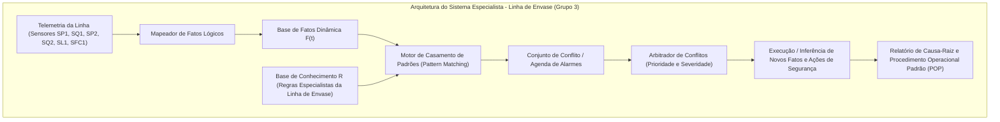

# Aula 08: Sistemas Especialistas — Base de Conhecimento e Regras de Diagnóstico

**Projeto Integrador / Disciplina:** Matemática Discreta e Sistemas Digitais  
**Curso:** Engenharia de Controle e Automação (ECA)  
**Sistema:** Linha Automatizada de Envasamento e Tampamento de Bebidas  
**Grupo:** Grupo 3 — ECAA08  

---

## 1. Fundamentos Matemáticos: Arquitetura de Sistemas Baseados em Regras (RBS)

Em linhas industriais de envasamento e tampamento de bebidas, a ocorrência de distúrbios operacionais simultâneos (como picos de vazão e quedas de pressão) exige diagnósticos rápidos baseados em **Sistemas Especialistas Baseados em Regras** (*Rule-Based Expert Systems*).

Formalmente, um Sistema Baseado em Regras é modelado pela tripla:

$$\langle \mathcal{F}, \mathcal{R}, \mathcal{E} \rangle$$

Onde:
1. **$\mathcal{F}$ (Base de Fatos):** Conjunto finito de proposições lógicas ativas que representam o estado instantâneo de sensores e atuadores na linha de produção:
   $$\mathcal{F}(t) = \{f_1, f_2, \dots, f_m\} \subseteq \mathcal{U}_{\text{fatos}}$$
2. **$\mathcal{R}$ (Base de Conhecimento / Regras de Produção):** Conjunto de sentenças em **Cláusulas de Horn Definidas** da forma:
   $$R_i: \quad \text{SE } (A_{i,1} \land A_{i,2} \land \dots \land A_{i,k}) \quad \text{ENTÃO } \quad C_i$$
   Equivalentemente em lógica proposicional:
   $$\neg A_{i,1} \lor \neg A_{i,2} \lor \dots \lor \neg A_{i,k} \lor C_i$$
   Onde $A_{i,j}$ são os fatos antecedentes associados a medições ou variáveis da planta, e $C_i$ é o consequente lógico (fato inferido de diagnóstico de falha).
3. **$\mathcal{E}$ (Estratégia de Resolução de Conflitos):** Regras e critérios de arbitragem (como prioridade de segurança, nível de severidade e tempo de resposta) aplicados quando múltiplas regras são ativadas simultaneamente.

---

## 2. Catálogo Especialista de Falhas da Linha de Envasamento

A base de conhecimento cobre os 6 cenários operacionais críticos identificados na linha de envasamento e tampamento de bebidas do Grupo 3:

| ID Regra | Antecedentes ($\bigwedge A_i$) | Consequente ($C_i$) | Diagnóstico de Causa-Raiz | Severidade / Ação |
| :--- | :--- | :--- | :--- | :--- |
| **R-01** | `p_max1` $\land$ `q_max1` | `SOBRECARGA_LINHA_ALIMENTACAO` | **Sobrecarga de Pressão e Vazão na Entrada da Linha** | **CRÍTICA:** Desarmar bomba BC1 e fechar VS1 |
| **R-02** | `SOBRECARGA_LINHA_ALIMENTACAO` $\land$ `y_valv1` | `TRIP_BLOQUEIO_EMERGENCIA` | **Falha de Alívio com Válvula Principal VS1 Aberta sob Sobrecarga** | **CRÍTICA:** Fechar VS1 e desligar BC1 via contator |
| **R-03** | `p_min1` $\land$ `y_bomba` | `CAVITACAO_BOMBA_BC1` | **Risco Crítico de Cavitação e Falha Mecânica na Bomba BC1** | **ALTA:** Desligar bomba BC1 e checar nível de TS1 |
| **R-04** | `p_max2` | `SOBREPRESSAO_ACUMULADOR_AS1` | **Sobrepressão Acima do Limite de Projeto no Acumulador AS1** | **CRÍTICA:** Aliviar pressão e cortar fluxo para AS1 |
| **R-05** | `q_min2` $\land$ `y_valv2` | `OBSTRUCAO_BICO_ENVASE` | **Bloqueio ou Entupimento Mecânico no Bico de Envase VS2** | **ALTA:** Parar esteira RC1 e realizar retrolavagem |
| **R-06** | `p_max2` $\land$ `y_valv3` | `SOBREPRESSAO_SISTEMA_CAPPING` | **Pressão Pneumática Excessiva no Atuador de Tampamento AC1** | **CRÍTICA:** Fechar válvula VS3 de capping e aliviar ar |

---

## 3. Resolução de Conflitos e Inconsistências na Base

Para garantir a confiabilidade operacional e evitar que o SCADA tome decisões incoerentes:
1. **Consistência Semântica:** Não podem coexistir na base regras tais que $A \rightarrow C$ e $A \rightarrow \neg C$ (contradição lógica).
2. **Ausência de Redundâncias:** Regras duplicadas com os mesmos antecedentes e consequentes são eliminadas para otimizar a velocidade de busca.
3. **Priorização por Severidade:** Em situações de incidentes múltiplos, regras classificadas como **CRÍTICA** (prioridade 9 e 10) são processadas antes de regras classificadas como **ALTA** (prioridade 7 e 8).

---

## 4. Arquitetura da Solução em Python

A modelagem em código utiliza programação orientada a objetos didática, dividida em três pilares principais:

### 4.1. Classe `Fato`
Modela as proposições de estado da planta.
- **Campos:** `nome` (ID do fato), `valor` (booleano), `descricao`, `fonte` (origem: 'SENSOR' ou 'INFERIDO') e `timestamp`.

### 4.2. Classe `RegraDiagnostico`
Modela a Cláusula de Horn individual.
- **Campos:** `id_regra`, `antecedentes` (conjunto de strings de fatos necessários), `consequente` (fato inferido), `descricao_diagnostico`, `severidade`, `prioridade` (1 a 10), `tempo_resposta_max_s` e `procedimento_pop` (Procedimento Operacional Padrão).

### 4.3. Classe `BaseConhecimentoSCADA`
Gerenciador central da base de regras.
- **Métodos:**
  - `adicionar_regra()`: Cadastra regras e alimenta o índice invertido.
  - `obter_regras_por_fato()`: Recupera regras de forma eficiente baseada em um antecedente modificado.
  - `verificar_consistencia()`: Varre a base em busca de conflitos lógicos (mesmo antecedente gerando conclusões distintas).
  - `verificar_redundancias()`: Varre a base para identificar regras redundantes.
  - `exportar_catalogo()`: Retorna a lista de regras ordenada por prioridade para renderização.

---

## 5. Exemplos de Entrada e Saída

### Cenário 1: Risco de Cavitação na Bomba BC1
* **Entrada (Fatos Ativados):**
  - Fato `p_min1` = `True` (Baixa pressão na sucção do sensor SP1)
  - Fato `y_bomba` = `True` (Bomba BC1 ligada)
* **Processamento:**
  - O motor detecta a conjunção de antecedentes `p_min1 AND y_bomba`.
  - Dispara a regra **R-03**.
* **Saída (Diagnóstico Gerado):**
  - **Fato Inferido:** `CAVITACAO_BOMBA_BC1`
  - **Diagnóstico:** *"Risco Crítico de Cavitação e Falha Mecânica na Bomba BC1"*
  - **Severidade:** ALTA (Prioridade 8)
  - **Tempo Limite de Resposta:** 2.0 segundos
  - **Ação Recomendada (POP):** *"POP-MA-04: Desligar bomba BC1 e verificar nível do tanque de suprimento TS1"*

### Cenário 2: Sobrecarga e Trip na Alimentação
* **Entrada (Fatos Ativados):**
  - Fato `p_max1` = `True` (Alta pressão em SP1)
  - Fato `q_max1` = `True` (Alta vazão em SQ1)
* **Processamento (Cadeia de Inferência):**
  - Passagem 1: `p_max1 AND q_max1` ativa a regra **R-01**, inferindo o fato intermediário `SOBRECARGA_LINHA_ALIMENTACAO`.
  - Passagem 2: O fato inferido `SOBRECARGA_LINHA_ALIMENTACAO` em conjunto com o fato `y_valv1` = `True` (Válvula solenoide VS1 aberta) ativa a regra **R-02**.
* **Saída (Diagnóstico Gerado):**
  - **Fato Inferido:** `TRIP_BLOQUEIO_EMERGENCIA`
  - **Diagnóstico:** *"Falha de Alívio com Válvula Principal VS1 Aberta sob Sobrecarga"*
  - **Severidade:** CRÍTICA (Prioridade 10)
  - **Tempo Limite de Resposta:** 0.5 segundos
  - **Ação Recomendada (POP):** *"POP-SIS-02: Interromper contator da bomba BC1 e forçar fechamento de VS1 via PLC"*
