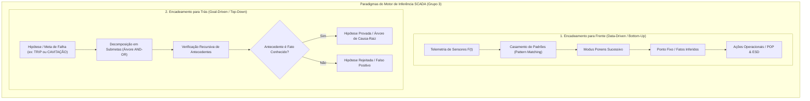
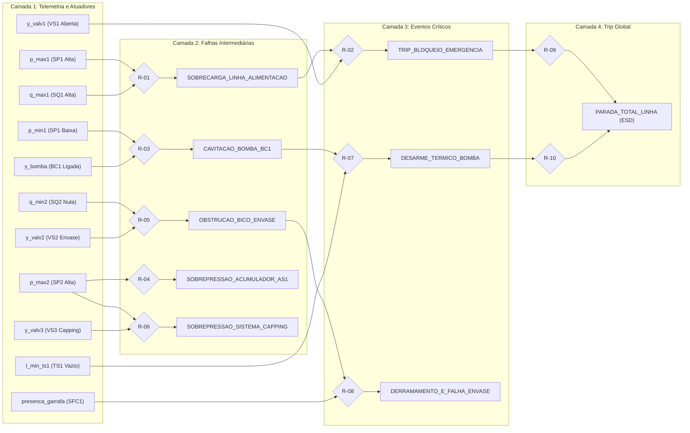

# Aula 09: Motores de Inferência — Encadeamento para Frente (*Forward Chaining*) e para Trás (*Backward Chaining*)

**Projeto Integrador / Disciplina:** Matemática Discreta e Sistemas Digitais  
**Curso:** Engenharia de Controle e Automação (ECA)  
**Sistema:** Linha Automatizada de Envasamento e Tampamento de Bebidas  
**Grupo:** Grupo 3 — ECAA08  
**Repositório:** [Grupo 3 - ECAA08](https://github.com/GuiCastro7/Grupo-3---ECAA08.git)

---

## 1. Fundamentos Matemáticos: Algoritmos de Inferência em Lógica de Produção

Na automação e supervisão em tempo real de plantas industriais complexas, como a nossa **Linha Automatizada de Envasamento e Tampamento de Bebidas**, o diagnóstico de anomalias operacionais e a execução de intertravamentos de segurança (normas IEC 61508, IEC 61511 e NR-12) são executados por um **Motor de Inferência (*Inference Engine*)**.

Formalmente, um Sistema Especialista Baseado em Regras é modelado pela tripla:

$$\langle \mathcal{F}, \mathcal{R}, \mathcal{E} \rangle$$

Onde:
1. **$\mathcal{F}$ (Base de Fatos):** Conjunto finito de proposições lógicas ativas que representam o estado instantâneo da telemetria de campo (sensores de vazão, pressão, nível e estado dos atuadores da linha):
   $$\mathcal{F}(t) = \{f_1, f_2, \dots, f_m\} \subseteq \mathcal{U}_{\text{fatos}}$$
2. **$\mathcal{R}$ (Base de Conhecimento / Regras de Produção):** Conjunto de sentenças expressas em **Cláusulas de Horn Definidas**:
   $$R_i: \quad (A_{i,1} \land A_{i,2} \land \dots \land A_{i,k}) \rightarrow C_i \equiv \neg A_{i,1} \lor \neg A_{i,2} \lor \dots \lor \neg A_{i,k} \lor C_i$$
   Onde $A_{i,j}$ são as premissas/antecedentes e $C_i$ é o consequente lógico (fato intermediário ou diagnóstico final de falha).
3. **$\mathcal{E}$ (Estratégia de Resolução de Conflitos):** Função de ordenação e arbitragem baseada em critérios de prioridade de segurança funcional, severidade de risco de processo e tempo máximo de resposta.

O motor de inferência utiliza dois paradigmas computacionais complementares para raciocínio automatizado: **Encadeamento para Frente (*Forward Chaining*)** e **Encadeamento para Trás (*Backward Chaining*)**.

---

### 1.1. Encadeamento para Frente (*Forward Chaining* — Data-Driven)

O **Encadeamento para Frente** é uma estratégia direcionada por dados (*data-driven*) e de raciocínio ascendente (*bottom-up*). Ele opera de forma contínua durante o tempo de varredura (*scan-time*) do CLP e dos servidores SCADA.

#### Formulação Algorítmica e Matemática
1. **Inicialização:** A base de fatos conhecidos $\mathcal{F}_0$ recebe as variáveis booleanas ativas dos sensores no instante $t$:
   $$\mathcal{F}_0 = \mathcal{F}_{\text{telemetria}}(t)$$
2. **Ciclo de Dedução (*Modus Ponens* Sucessivo):** Em cada iteração $k \ge 0$, o motor identifica todas as regras $R_i \in \mathcal{R}$ cujos antecedentes são um subconjunto dos fatos conhecidos:
   $$\text{Agenda}(k) = \left\{ R_i \in \mathcal{R} \mid \text{Antecedentes}(R_i) \subseteq \mathcal{F}_k \;\land\; \text{Consequente}(R_i) \notin \mathcal{F}_k \right\}$$
3. **Resolução de Conflitos:** Se $\text{Agenda}(k) \neq \emptyset$, seleciona-se a regra de maior prioridade/severidade:
   $$R^* = \arg\max_{R \in \text{Agenda}(k)} \big(\text{Prioridade}(R)\big)$$
   O consequente é incorporado: $\mathcal{F}_{k+1} = \mathcal{F}_k \cup \{\text{Consequente}(R^*)\}$.
4. **Ponto Fixo (*Fixed Point*):** O algoritmo encerra quando nenhum fato novo pode ser deduzido:
   $$\mathcal{F}_{k+1} = \mathcal{F}_k \implies \mathcal{F}_{\text{final}} = \text{PontoFixo}(\mathcal{F}_0, \mathcal{R})$$

A complexidade temporal do *Forward Chaining* com $n$ regras e $m$ fatos é $\mathcal{O}(n \cdot m)$, sendo altamente determinística para implementação em sistemas embarcados e CLPs de alta confiabilidade.

---

### 1.2. Encadeamento para Trás (*Backward Chaining* — Goal-Driven)

O **Encadeamento para Trás** é uma estratégia direcionada por metas (*goal-driven*) e de raciocínio descendente (*top-down*). É utilizado em módulos periciais do SCADA, investigação pós-acidente (*Root Cause Analysis - RCA*) e verificação de condições necessárias antes da partida da planta.

#### Formulação Algorítmica e Matemática
Dada uma meta ou hipótese $G$ (ex: $G = \text{"PARADA\_TOTAL\_LINHA"}$):
1. **Caso Base 1 (Fato Primitivo):** Se $G \in \mathcal{F}$, a meta é imediatamente provada como **Verdadeira**.
2. **Caso Base 2 (Ciclo / Loop Detection):** Se $G$ já está presente no conjunto de metas em avaliação ativa $\mathcal{V}_{\text{visitados}}$, aborta-se o ramo para evitar recursão infinita provocada por dependências circulares.
3. **Passo Indutivo (Árvore AND-OR):**
   - O motor busca todas as regras $R \in \mathcal{R}$ onde $\text{Consequente}(R) = G$ (nós **OR**).
   - Para cada regra candidata $R$, a meta $G$ é provada se e somente se **todos** os seus antecedentes $\{A_1, A_2, \dots, A_k\}$ forem recursivamente provados (nós **AND**):
     $$\text{Provar}(G) \iff \exists R \in \mathcal{R}_{G} \left( \forall A_j \in \text{Antecedentes}(R), \; \text{Provar}(A_j) \right)$$
4. **Árvore de Explicação (*Explanation Facility*):** O algoritmo constrói a árvore de prova estruturada, permitindo ao engenheiro de automação auditar exatamente por que uma determinada decisão de intertravamento foi disparada.

---

## 2. Catálogo Especialista e Grafo Causal da Linha de Envasamento (Grupo 3)

A base de conhecimento da linha de envasamento e tampamento de bebidas modela as relações causais entre sensores de pressão (SP1, SP2), vazão (SQ1, SQ2), nível (tanque TS1), presença (SFC1), acionamentos de bombas e válvulas (BC1, VS1, VS2, VS3) e os diagnósticos de falha.

| ID Regra | Antecedentes ($\bigwedge A_i$) | Consequente ($C_i$) | Diagnóstico de Causa-Raiz | Severidade | Prio | POP Associado |
| :--- | :--- | :--- | :--- | :---: | :---: | :--- |
| **R-01** | `p_max1` $\land$ `q_max1` | `SOBRECARGA_LINHA_ALIMENTACAO` | Sobrecarga de Pressão e Vazão na Entrada da Linha | **CRÍTICA** | 10 | `POP-SIS-01`: Cortar alimentação, parar bomba BC1 e fechar válvula VS1 |
| **R-02** | `SOBRECARGA_LINHA_ALIMENTACAO` $\land$ `y_valv1` | `TRIP_BLOQUEIO_EMERGENCIA` | Falha de Alívio com Válvula Principal VS1 Aberta sob Sobrecarga | **CRÍTICA** | 10 | `POP-SIS-02`: Interromper contator da bomba BC1 e forçar fechamento de VS1 |
| **R-03** | `p_min1` $\land$ `y_bomba` | `CAVITACAO_BOMBA_BC1` | Risco Crítico de Cavitação e Falha Mecânica na Bomba BC1 | **ALTA** | 8 | `POP-MA-04`: Desligar bomba BC1 e verificar nível do tanque de suprimento TS1 |
| **R-04** | `p_max2` | `SOBREPRESSAO_ACUMULADOR_AS1` | Sobrepressão Acima do Limite de Projeto no Acumulador AS1 | **CRÍTICA** | 9 | `POP-SST-08`: Acionar alívio pneumático de emergência e cortar fluxo para AS1 |
| **R-05** | `q_min2` $\land$ `y_valv2` | `OBSTRUCAO_BICO_ENVASE` | Bloqueio ou Entupimento Mecânico no Bico de Envase VS2 | **ALTA** | 7 | `POP-SEC-02`: Parar esteira RC1, isolar ramal de envase e realizar retrolavagem |
| **R-06** | `p_max2` $\land$ `y_valv3` | `SOBREPRESSAO_SISTEMA_CAPPING` | Pressão Pneumática Excessiva no Atuador de Tampamento AC1 | **CRÍTICA** | 9 | `POP-CRIO-01`: Fechar válvula de capping VS3 e aliviar pressão residual |
| **R-07** | `CAVITACAO_BOMBA_BC1` $\land$ `l_min_ts1` | `DESARME_TERMICO_BOMBA` | Esgotamento do Tanque TS1 com Bomba a Seco e Sobrecarga Térmica | **CRÍTICA** | 9 | `POP-MA-05`: Bloqueio do circuito elétrico da bomba BC1 e reabastecimento de TS1 |
| **R-08** | `OBSTRUCAO_BICO_ENVASE` $\land$ `presenca_garrafa` | `DERRAMAMENTO_E_FALHA_ENVASE` | Falha de Dosagem com Garrafa no Posto e Risco de Transbordamento | **ALTA** | 8 | `POP-SEC-03`: Rejeição da garrafa para descarte e purga de ar no bico dosador |
| **R-09** | `TRIP_BLOQUEIO_EMERGENCIA` | `PARADA_TOTAL_LINHA` | Desarme de Emergência Geral por Falha Crítica de Alimentação | **CRÍTICA** | 10 | `POP-ESD-01`: Desabilitar saídas do CLP, acionar alarme geral e registrar log |
| **R-10** | `DESARME_TERMICO_BOMBA` | `PARADA_TOTAL_LINHA` | Desarme Geral por Perda Crítica do Grupo de Bombeamento | **CRÍTICA** | 10 | `POP-ESD-01`: Desabilitar saídas do CLP, acionar alarme geral e registrar log |

---

## 3. Cenários Operacionais de Inferência e Diagnóstico

### Cenário 1: Encadeamento para Frente — Sobrecarga, Trip e Parada Geral
* **Telemetria de Entrada $\mathcal{F}_0$:** `p_max1 = True`, `q_max1 = True`, `y_valv1 = True`.
* **Execução do Forward Chaining:**
  1. **Passo 1:** Casamento de `p_max1` e `q_max1` dispara a regra **R-01** $\implies$ Infere `SOBRECARGA_LINHA_ALIMENTACAO`.
  2. **Passo 2:** Casamento de `SOBRECARGA_LINHA_ALIMENTACAO` e `y_valv1` dispara **R-02** $\implies$ Infere `TRIP_BLOQUEIO_EMERGENCIA`.
  3. **Passo 3:** Casamento de `TRIP_BLOQUEIO_EMERGENCIA` dispara **R-09** $\implies$ Infere `PARADA_TOTAL_LINHA`.
* **Ponto Fixo:** Nenhuma nova regra pode ser disparada. A planta atinge o estado seguro com desarme total.

### Cenário 2: Encadeamento para Frente — Cavitação e Desarme Térmico de Bomba
* **Telemetria de Entrada $\mathcal{F}_0$:** `p_min1 = True`, `y_bomba = True`, `l_min_ts1 = True`.
* **Execução do Forward Chaining:**
  1. **Passo 1:** Casamento de `p_min1` e `y_bomba` dispara **R-03** $\implies$ Infere `CAVITACAO_BOMBA_BC1`.
  2. **Passo 2:** Casamento de `CAVITACAO_BOMBA_BC1` e `l_min_ts1` dispara **R-07** $\implies$ Infere `DESARME_TERMICO_BOMBA`.
  3. **Passo 3:** Casamento de `DESARME_TERMICO_BOMBA` dispara **R-10** $\implies$ Infere `PARADA_TOTAL_LINHA`.

### Cenário 3: Encadeamento para Trás — Perícia Causal Pós-Acidente (*Root Cause Analysis*)
* **Meta / Hipótese Investigada:** $G = \text{"PARADA\_TOTAL\_LINHA"}$.
* **Fatos Gravados no Buffer Histórico:** $\mathcal{F} = \{\text{p\_max1}, \text{q\_max1}, \text{y\_valv1}\}$.
* **Árvore de Dedução Top-Down:**
  - Para provar `PARADA_TOTAL_LINHA`, analisa-se **R-09** (`TRIP_BLOQUEIO_EMERGENCIA`).
  - Para provar `TRIP_BLOQUEIO_EMERGENCIA`, analisa-se **R-02** (`SOBRECARGA_LINHA_ALIMENTACAO` $\land$ `y_valv1`).
  - O fato `y_valv1` é comprovado na base.
  - Para provar `SOBRECARGA_LINHA_ALIMENTACAO`, analisa-se **R-01** (`p_max1` $\land$ `q_max1`).
  - Ambos os fatos `p_max1` e `q_max1` são comprovados na base.
* **Resultado:** **HIPÓTESE COMPROVADA!** A causa-raiz identificada foi a sobrecarga de alimentação com válvula aberta.

### Cenário 4: Encadeamento para Trás — Rejeição de Hipótese (Falso Positivo)
* **Meta / Hipótese Investigada:** $G = \text{"SOBREPRESSAO\_SISTEMA\_CAPPING"}$.
* **Fatos Gravados:** $\mathcal{F} = \{\text{p\_max2}\}$ (Válvula VS3 estava desenergizada, portanto `y_valv3` = False).
* **Avaliação Recursiva:**
  - A regra **R-06** exige `p_max2` $\land$ `y_valv3`.
  - `p_max2` é verdadeiro, porém `y_valv3` não está na base de fatos nem pode ser inferido por outra regra.
* **Resultado:** **HIPÓTESE REJEITADA!** O sistema descarta falha no atuador de capping, evitando parada desnecessária do carrossel de tampamento.

---

## 4. Arquitetura da Solução em Python (SCADA-Core)

O código desenvolvido adota os mais altos padrões de Engenharia de Software e Orientação a Objetos:

1. **`@dataclass Fato`:** Modela átomos proposicionais da planta contendo `nome`, `valor`, `descricao`, `fonte` (`'SENSOR'` ou `'INFERIDO'`) e `timestamp`.
2. **`@dataclass RegraDiagnostico`:** Representa Cláusulas de Horn com `id_regra`, `antecedentes`, `consequente`, `descricao_diagnostico`, `severidade`, `prioridade`, `tempo_resposta_max_s` e `procedimento_pop`.
3. **`class BaseConhecimentoSCADA`:** Gerenciador da base com índices duplos invertidos (busca rápida por antecedente e por consequente), verificação de consistência semântica e exportação tabular.
4. **`class MotorInferenciaHibrido`:**
   - `forward_chaining(fatos_iniciais)`: Executa o loop de ponto fixo, aplicando resolução de conflitos por prioridade e gerando o relatório tabular da **Trilha de Auditoria (*Audit Trail*)**.
   - `backward_chaining(meta, fatos_iniciais)`: Executa a busca recursiva em profundidade (DFS) na árvore AND-OR com prevenção de loops, retornando o status booleano, log pericial passo a passo e a árvore estruturada de prova.
   - `explicar_meta(meta, fatos_iniciais)`: Interface com o operador do SCADA, gerando relatório textual detalhado sobre a cadeia causal.

---

## 5. Comparativo Quantitativo de Desempenho e Requisitos de Tempo Real

| Métrica / Critério | Encadeamento para Frente (*Forward*) | Encadeamento para Trás (*Backward*) |
| :--- | :--- | :--- |
| **Direção de Raciocínio** | Ascendente (*Bottom-Up*): Dados $\to$ Conclusões | Descendente (*Top-Down*): Meta $\to$ Evidências |
| **Orientação Operacional** | *Data-Driven* (Direcionado por Telemetria) | *Goal-Driven* (Direcionado por Hipótese) |
| **Aplicação na Automação** | Monitoramento contínuo em tempo de varredura (*Scan-Time*) do CLP | Módulo pericial pós-falha (*RCA*), auditoria e partida de planta |
| **Gatilho de Execução** | Variação de estado em sensores de campo ($\Delta \mathcal{F}$) | Requisição de alarme pelo operador ou script de segurança |
| **Complexidade Temporal** | Determinística $\mathcal{O}(|\mathcal{R}| \cdot |\mathcal{F}|)$ — Ideal para IEC 61131-3 | $\mathcal{O}(b^d)$ (pior caso em grafos profundos, podado por DFS) |
| **Consumo de Memória** | Linear $\mathcal{O}(|\mathcal{F}_{\text{fatos}}|)$ | Pilha de chamadas recursivas $\mathcal{O}(d_{\text{máx}})$ |
| **Resultado Produzido** | Conjunto fechado de todos os diagnósticos ativos e POPs | Árvore de prova estrita da meta consultada (*Explanation Tree*) |

---

## 6. Conclusão da Aula 09

A implementação integrada dos algoritmos de **Forward Chaining** e **Backward Chaining** no projeto da **Linha Automatizada de Envasamento e Tampamento de Bebidas** dota o sistema SCADA e os controladores lógicos de capacidades avançadas de diagnóstico e segurança funcional:
1. O **Forward Chaining** garante resposta em milissegundos a eventos catastróficos (como cavitação e sobrepressão), acionando intertravamentos antes que danos estruturais ocorram.
2. O **Backward Chaining** fornece rastreabilidade pericial e transparência (*Explainable AI / XAI*), permitindo que engenheiros e operadores compreendam a cadeia de eventos que culminou em uma parada de emergência.
