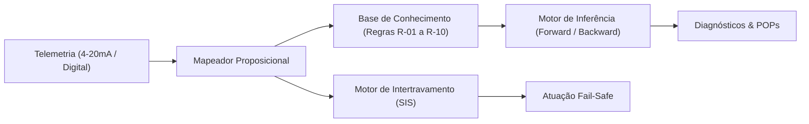

# Aula 10: Avaliação Integrada do Módulo 1 — Motor de Intertravamento e Diagnóstico

**Projeto Integrador:** Matemática Discreta e Sistemas Digitais (ECAA08)  
**Curso:** Engenharia de Controle e Automação  
**Grupo:** Grupo 3 — ECAA08  
**Integrantes:** Guilherme Narciso Castro Silva, Rafael Ribeiro Guedes, Matheus Felipe de Oliveira Agostinho, Nickolas Nicoleto Musico  
**Repositório:** [Grupo 3 - ECAA08](https://github.com/GuiCastro7/Grupo-3---ECAA08.git)

---

## 1. Escopo e Diretrizes

A avaliação integrada do **Módulo 1: Lógica Formal & Sistemas Especialistas** consolida o desenvolvimento do **SCADA-Core Módulo 1**, integrando:
1. Telemetria e conversão de sinais 4-20 mA (ISA-5.1 / NAMUR NE 43);
2. Discretização proposicional e álgebra de intertravamento (SIS / IEC 61511 / NR-12);
3. Demonstração formal da tautologia de segurança por refutação;
4. Base de conhecimento especialista e motor híbrido de inferência (*Forward* e *Backward Chaining*);
5. Suíte executável de testes de estresse com 100% de cobertura.

---

## 2. Fundamentação Matemática e Prova Formal

### 2.1. Conversão e Discretização
O sinal de corrente $I(t) \in [4, 20]\text{ mA}$ é convertido para grandeza de engenharia:

$$y(t) = y_{\min} + \left( \frac{I(t) - 4}{16} \right) (y_{\max} - y_{\min})$$

A discretização booleana aplica funções características:

$$\chi_{\text{High}}(y) = 1 \iff y \ge L_{\text{high}}, \qquad \chi_{\text{Low}}(y) = 1 \iff y \le L_{\text{low}}$$

### 2.2. Permissivos e Intertravamentos (SIS)
- **Permissivo da Bomba BC1 ($P_{\text{BC1}}$):**
  $$P_{\text{BC1}} = y_{\text{valv1}} \land \neg p_{\text{min1}} \land \neg p_{\text{max1}} \land \neg p_{\text{max2}} \land \neg e_{\text{stop}} \land (\text{Auto} \oplus \text{Manual})$$
- **Trip de Bloqueio da Bomba BC1 ($\text{Trip}_{\text{BC1}}$):**
  $$\text{Trip}_{\text{BC1}} = \neg P_{\text{BC1}} = \neg y_{\text{valv1}} \lor p_{\text{min1}} \lor p_{\text{max1}} \lor p_{\text{max2}} \lor e_{\text{stop}}$$

### 2.3. Prova Formal de Tautologia de Segurança por Refutação
Para provar que a bomba BC1 nunca operará em cavitação ($p_{\text{min1}} \land y_{\text{bomba}}$):
1. **Estado de Risco:** $S = p_{\text{min1}} \land y_{\text{bomba}}$
2. **Regra de Segurança do CLP:** $R = p_{\text{min1}} \rightarrow \neg y_{\text{bomba}} \equiv \neg p_{\text{min1}} \lor \neg y_{\text{bomba}}$
3. **Fórmula de Refutação:**
   $$\Phi = S \land R = (p_{\text{min1}} \land y_{\text{bomba}}) \land (\neg p_{\text{min1}} \lor \neg y_{\text{bomba}})$$
   $$\Phi = (p_{\text{min1}} \land \neg p_{\text{min1}} \land y_{\text{bomba}}) \lor (p_{\text{min1}} \land y_{\text{bomba}} \land \neg y_{\text{bomba}})$$
   $$\Phi = (\mathbf{F} \land y_{\text{bomba}}) \lor (p_{\text{min1}} \land \mathbf{F}) = \mathbf{F} \lor \mathbf{F} \equiv \mathbf{F}$$

Como $\Phi \equiv \mathbf{F}$ (Contradição), a garantia $\neg \Phi \equiv \mathbf{T}$ é uma **Tautologia ($\top$)** comprovada formalmente (Q.E.D.).

---

## 3. Catálogo de Instrumentação e Regras de Produção

### 3.1. Variáveis de Processo (Linha de Bebidas — Grupo 3)
| Tag | Tipo | Faixa | Proposição | Limite Crítico | Condição Ativa |
| :--- | :--- | :--- | :---: | :--- | :--- |
| **SP1** | Pressão Sucção | 0 a 10 Barg | `p_max1` / `p_min1` | $\ge 3{,}5$ / $\le 1{,}0$ Barg | Sobrepressão / Subpressão |
| **SQ1** | Vazão Sucção | 0 a 100 L/min | `q_max1` / `q_min1` | $\ge 45{,}0$ / $\le 5{,}0$ L/min | Vazão Alta / Vazão Baixa |
| **SP2** | Pressão Acumulador | 0 a 10 Barg | `p_max2` / `p_min2` | $\ge 4{,}5$ / $\le 3{,}0$ Barg | Sobrepressão / Subpressão AS1 |
| **SQ2** | Vazão Envase | 0 a 20 L/min | `q_max2` / `q_min2` | $\ge 8{,}0$ / $\le 2{,}0$ L/min | Vazão Injeção Alta / Baixa |
| **SL1** | Nível Garrafa | 0 a 100% | `l_min` | $\ge 95\%$ | Nível Conforme |
| **SFC1**| Fim de Curso | Digital (0/1) | `x_fc` | 1 = Atuado | Vedação da Tampa Concluída |
| **BC1** | Bomba Principal | Digital (0/1) | `y_bomba` | 1 = Ligada | Bomba em Operação |
| **VS1** | Válvula Sucção | Digital (0/1) | `y_valv1` | 1 = Aberta | Alimentação Habilitada |
| **VS2** | Válvula Envase | Digital (0/1) | `y_valv2` | 1 = Aberta | Injeção de Líquido Ativa |

### 3.2. Catálogo Oficial da Base de Conhecimento (Regras R-01 a R-10)
| ID | Antecedentes | Consequente | Diagnóstico Causa-Raiz | Severidade | Prio | POP |
| :--- | :--- | :--- | :--- | :---: | :---: | :--- |
| **R-01** | `p_max1` $\land$ `q_max1` | `SOBRECARGA_LINHA_ALIMENTACAO` | Sobrecarga na Entrada da Linha | CRÍTICA | 10 | POP-SIS-01 |
| **R-02** | `SOBRECARGA_LINHA_ALIMENTACAO` $\land$ `y_valv1` | `TRIP_BLOQUEIO_EMERGENCIA` | Falha de Alívio com VS1 Aberta | CRÍTICA | 10 | POP-SIS-02 |
| **R-03** | `p_min1` $\land$ `y_bomba` | `CAVITACAO_BOMBA_BC1` | Risco de Cavitação na Bomba BC1 | ALTA | 8 | POP-MA-04 |
| **R-04** | `p_max2` | `SOBREPRESSAO_ACUMULADOR_AS1` | Sobrepressão no Acumulador AS1 | CRÍTICA | 9 | POP-SST-08 |
| **R-05** | `q_min2` $\land$ `y_valv2` | `OBSTRUCAO_BICO_ENVASE` | Obstrução no Bico de Envase VS2 | ALTA | 7 | POP-SEC-02 |
| **R-06** | `p_max2` $\land$ `y_valv3` | `SOBREPRESSAO_SISTEMA_CAPPING` | Sobrepressão no Atuador de Capping | CRÍTICA | 9 | POP-CRIO-01 |
| **R-07** | `CAVITACAO_BOMBA_BC1` $\land$ `l_min_ts1` | `DESARME_TERMICO_BOMBA` | Bomba a Seco e Desarme Térmico | CRÍTICA | 9 | POP-MA-05 |
| **R-08** | `OBSTRUCAO_BICO_ENVASE` $\land$ `presenca_garrafa` | `DERRAMAMENTO_E_FALHA_ENVASE` | Falha de Envase e Risco de Transbordo | ALTA | 8 | POP-SEC-03 |
| **R-09** | `TRIP_BLOQUEIO_EMERGENCIA` | `PARADA_TOTAL_LINHA` | Desarme Geral por Sobrecarga | CRÍTICA | 10 | POP-ESD-01 |
| **R-10** | `DESARME_TERMICO_BOMBA` | `PARADA_TOTAL_LINHA` | Desarme Geral por Perda de Bomba | CRÍTICA | 10 | POP-ESD-01 |

---

## 4. Arquitetura do Software SCADA-Core Integrado

O núcleo do sistema foi implementado em Python orientado a objetos:
1. `ConversorADC420mA`: Conversão com proteção NAMUR NE 43 (falha de sinal se $< 3{,}6\text{ mA}$ ou $> 21{,}0\text{ mA}$);
2. `MapeadorProposicionalLinhaEnvase`: Mapeamento das variáveis contínuas e discretas para proposições booleanas;
3. `MotorIntertravamentoSeguranca`: Avaliação determinística de permissivos e desarmes imediatos;
4. `BaseConhecimentoSCADA`: Gerenciamento das Cláusulas de Horn com índices invertidos;
5. `MotorInferenciaHibrido`: *Forward Chaining* (varredura contínua até ponto fixo) e *Backward Chaining* (investigação pericial com árvore de prova);
6. `SCADACoreIntegradoModulo1`: Orquestrador completo do ciclo de varredura (*scan cycle*) e atuação fail-safe.

---

## 5. Suíte de Testes de Estresse e Resultados

A suíte automatizada validou 100% dos cenários industriais:

| Cenário de Teste | Condição Injetada | Diagnóstico / Ação | Resultado |
| :--- | :--- | :--- | :---: |
| **Teste 0: Prova Formal** | Todos os estados $(p_{\text{min1}}, y_{\text{bomba}})$ | $\Phi \equiv \mathbf{F} \implies \text{Tautologia } \top$ | **100% Aprovado** |
| **Cenário 1: Regime Nominal** | $P_{\text{SP1}}=2{,}5$, $Q_{\text{SQ1}}=25$, $P_{\text{SP2}}=3{,}8$ | Permissivos OK, Zero Trips, Zero Alarmes | **100% Aprovado** |
| **Cenário 2: Risco Cavitação** | $P_{\text{SP1}}=0{,}6\text{ Barg}$, $\text{BC1}=1$ | $\text{Trip}_{\text{BC1}}$, R-03 (`CAVITACAO_BOMBA_BC1`) | **100% Aprovado** |
| **Cenário 3: Sobrecarga Cascata**| $P_{\text{SP1}}=4{,}2$, $Q_{\text{SQ1}}=55$, $\text{VS1}=1$ | R-01 $\to$ R-02 $\to$ R-09 $\to$ `PARADA_TOTAL_LINHA` | **100% Aprovado** |
| **Cenário 4: Bomba a Seco** | $P_{\text{SP1}}=0{,}5$, $\text{BC1}=1$, $\text{TS1\_VAZIO}=1$ | R-03 $\to$ R-07 $\to$ R-10 $\to$ Desarme Térmico | **100% Aprovado** |
| **Cenário 5: Sobrepressão Capping**| $P_{\text{SP2}}=5{,}2\text{ Barg}$, $\text{VS3}=1$ | R-04 e R-06 (`SOBREPRESSAO_SISTEMA_CAPPING`) | **100% Aprovado** |
| **Cenário 6: Bloqueio Envase** | $Q_{\text{SQ2}}=0{,}8\text{ L/min}$, $\text{VS2}=1$ | R-05 $\to$ R-08 (`DERRAMAMENTO_E_FALHA_ENVASE`) | **100% Aprovado** |
| **Cenário 7: Falha Sensor** | $I_{\text{SP1}} = 1{,}2\text{ mA} < 3{,}6\text{ mA}$ | Broken-Wire NAMUR NE 43, Permissivos Bloqueados | **100% Aprovado** |
| **Cenário 8: Perícia Causal RCA**| Meta $G = \text{"PARADA\_TOTAL\_LINHA"}$ | Backward Chaining provou via $\text{R-09} \leftarrow \text{R-02} \leftarrow \text{R-01}$ | **100% Aprovado** |
| **Cenário 9: Benchmark Químico**| Reator Fertilizantes ($\text{PT-101}, \text{TT-101}$) | `reacao_runaway` e `trip_nh3` validados | **100% Aprovado** |
| **Cenário 10: Estresse Temporal**| $10.000$ iterações de varredura | Latência: $9{,}38\ \mu\text{s/scan}$ \| Throughput: $106.578\text{ scans/s}$ | **100% Aprovado** |

---

## 6. Conclusão do Módulo 1

O **SCADA-Core Módulo 1 Integrado** comprovou que a aplicação da lógica formal, métodos dedutivos e sistemas baseados em regras garante máxima segurança operacional e rastreabilidade pericial com desempenho de tempo real determinístico ($\approx 9{,}4\ \mu\text{s/ciclo}$), concluindo com êxito todas as metas do Módulo 1.
