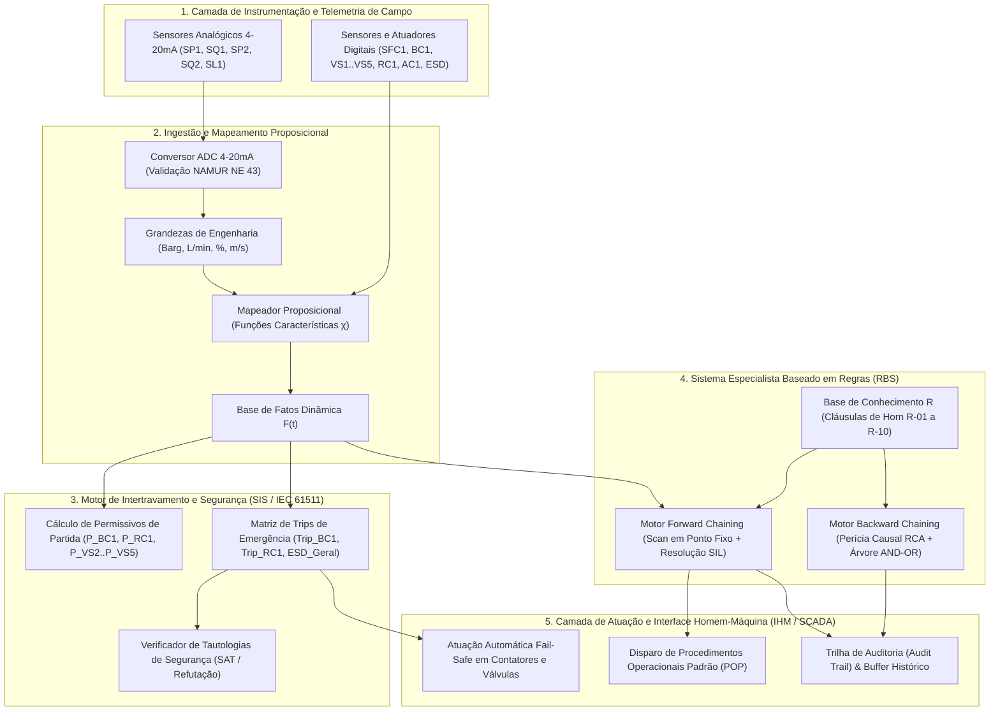

# Aula 10: Avaliação Integrada do Módulo 1 — Motor de Intertravamento e Diagnóstico

**Projeto Integrador / Disciplina:** Matemática Discreta e Sistemas Digitais (ECAA08)  
**Curso:** Engenharia de Controle e Automação (ECA)  
**Sistema:** Linha Automatizada de Envasamento e Tampamento de Bebidas & SCADA-Core Integrado  
**Grupo:** Grupo 3 — ECAA08  
**Repositório:** [Grupo 3 - ECAA08](https://github.com/GuiCastro7/Grupo-3---ECAA08.git)  
**Integrantes:**
- Guilherme Narciso Castro Silva
- Rafael Ribeiro Guedes
- Matheus Felipe de Oliveira Agostinho
- Nickolas Nicoleto Musico

---

## 1. Escopo e Diretrizes da Avaliação Integrada do Módulo 1

Nesta avaliação integradora, os estudantes consolidam a totalidade dos fundamentos teóricos e práticos desenvolvidos no **Módulo 1: Lógica Formal & Sistemas Especialistas**, demonstrando o funcionamento integrado, robusto e em tempo real do núcleo supervisório **SCADA-Core Módulo 1**.

A arquitetura computacional do sistema unifica os quatro pilares da automação inteligente e segurança funcional:

1. **Ingestão de Sinais Analógicos e Catálogo de Tags ISA-5.1:** Conversão de sinais $4\text{ a }20\text{ mA}$ para grandezas de engenharia com tratamento de ruído e detecção de rompimento de cabo (*broken-wire fault* / NAMUR NE 43);
2. **Discretização Proposicional e Lógica Booleana:** Mapeamento determinístico de medições contínuas em proposições lógicas atômicas através de funções características $\chi(x)$;
3. **Motor de Intertravamento e Prova Formal de Tautologias de Segurança:** Avaliação determinística de permissivos de partida (*Start Permissives*) e intertravamentos de bloqueio de emergência (*Emergency Trips / SIS / NR-12*), acompanhada da demonstração dedutiva formal por refutação ($\Phi_{\text{refutação}} \models \bot \iff \text{Tautologia } \top$);
4. **Base de Conhecimento Especialista e Motor de Inferência Híbrido:**
   - **Forward Chaining (Data-Driven / Bottom-Up):** Ciclo de varredura contínua (*scan-time*) com resolução de conflitos por prioridade de segurança (SIL 3) e dedução até ponto fixo (*Fixed Point*);
   - **Backward Chaining (Goal-Driven / Top-Down):** Módulo pericial de auditoria pós-evento (*Root Cause Analysis - RCA*) com geração da árvore de prova explicativa (*Explanation Facility*) e proteção estrita contra recursão infinita.

---

## 2. Fundamentação Matemática Discreta e Lógica Formal Integrada

### 2.1. Funções Características e Discretização Proposicional
Cada sinal analógico contínuo $x_i(t) \in \mathbb{R}$, transmitido via loop de corrente $I_i(t) \in [4, 20]\,\text{mA}$, é convertido linearmente para unidades de engenharia:

$y_i(t) = y_{i,\min} + \left( \frac{I_i(t) - 4.0}{16.0} \right) (y_{i,\max} - y_{i,\min})$

A discretização para os átomos proposicionais $p \in \{0, 1\}$ é governada por funções características com limites críticos definidos em projeto:

$\chi_{\text{High}}(y_i) = \begin{cases} 1 \text{ (True)}, & \text{se } y_i \ge L_{\text{crit,high}} \\ 0 \text{ (False)}, & \text{se } y_i < L_{\text{crit,high}} \end{cases} \qquad \chi_{\text{Low}}(y_i) = \begin{cases} 1 \text{ (True)}, & \text{se } y_i \le L_{\text{crit,low}} \\ 0 \text{ (False)}, & \text{se } y_i > L_{\text{crit,low}} \end{cases}$

### 2.2. Álgebra Booleana de Permissivos e Intertravamentos de Bloqueio (*Trips*)
Na engenharia de segurança de processos (normas **IEC 61508**, **IEC 61511** e **NR-12**), a lógica de intertravamento opera em duas dimensões complementares:

#### A. Permissivo de Partida da Bomba Centrífuga ($P_{\text{BC1}}$)
A energização da bomba de alimentação $\text{BC1}$ ($y_{\text{bomba}}$) é estritamente condicionada à suficiência de sucção, abertura da válvula $\text{VS1}$, ausência de sobrepressão em $\text{AS1}$ e seleção de modo operacional exclusivo:

$$P_{\text{BC1}} \equiv y_{\text{valv1}} \land \neg p_{\text{min1}} \land \neg p_{\text{max1}} \land \neg p_{\text{max2}} \land \neg e_{\text{stop}} \land (\text{Auto} \oplus \text{Manual})$$

#### B. Permissivo da Esteira Transportadora ($P_{\text{RC1}}$)
A esteira $\text{RC1}$ só pode tracionar se nenhum cabeçote pneumático ou bico estiver estendido na zona de transporte:

$P_{\text{RC1}} \equiv \neg \text{act}_{\text{VS2}} \land \neg \text{ext}_{\text{VS3}} \land \neg \text{ext}_{\text{VS4}} \land \neg \text{ext}_{\text{VS5}} \land \neg e_{\text{stop}} \land (\text{Auto} \oplus \text{Manual})$

#### C. Permissivo de Dosagem de Precisão ($P_{\text{VS2}}$)
A válvula solenoide de injeção de fluido $\text{VS2}$ só abre quando a garrafa estiver estática sob o posto e a pressurização hidráulica estiver estável:

$P_{\text{VS2}} \equiv \text{pos}_{\text{garrafa}} \land \neg cmd_{\text{RC1}} \land \neg p_{\text{min2}} \land \neg p_{\text{max2}} \land \neg q_{\text{min2}} \land \neg q_{\text{max2}} \land \neg e_{\text{stop}}$

#### D. Intertravamento de Bloqueio Instantâneo (*Trip*) e Leis de De Morgan
Em tempo real de varredura, o desarme imediato (*Trip*) da bomba $\text{BC1}$ é a negação de sua condição permissiva base, obtida pelas **Leis de De Morgan**:

$\text{Trip}_{\text{BC1}} \equiv \neg \left( y_{\text{valv1}} \land \neg p_{\text{min1}} \land \neg p_{\text{max1}} \land \neg p_{\text{max2}} \land \neg e_{\text{stop}} \right) \equiv \neg y_{\text{valv1}} \lor p_{\text{min1}} \lor p_{\text{max1}} \lor p_{\text{max2}} \lor e_{\text{stop}}$

---

### 2.3. Prova Formal de Tautologia de Segurança por Refutação (*Reductio ad Absurdum*)

Para garantir formalmente a integridade física da linha contra danos mecânicos destrutivos, prova-se que o estado perigoso de cavitação na bomba $\text{BC1}$ é logicamente impossível sob o intertravamento implementado.

* **Estado Crítico de Risco ($S_{\text{risco}}$):** Presença de subpressão de sucção ($p_{\text{min1}}$) mantendo a bomba ligada ($y_{\text{bomba}}$):
  $$S_{\text{risco}} \equiv p_{\text{min1}} \land y_{\text{bomba}}$$
* **Regra de Intertravamento do CLP:**
  $$R_{\text{SIS}} \equiv p_{\text{min1}} \rightarrow \neg y_{\text{bomba}} \equiv \neg p_{\text{min1}} \lor \neg y_{\text{bomba}}$$
* **Fórmula de Refutação ($\Phi_{\text{refutação}}$):** Conjunção do estado de risco com a regra do CLP:
  $$\Phi_{\text{refutação}} = S_{\text{risco}} \land R_{\text{SIS}} = (p_{\text{min1}} \land y_{\text{bomba}}) \land (\neg p_{\text{min1}} \lor \neg y_{\text{bomba}})$$

Aplicando a distributividade da conjunção sobre a disjunção:

$$\Phi_{\text{refutação}} = \big((p_{\text{min1}} \land y_{\text{bomba}}) \land \neg p_{\text{min1}}\big) \lor \big((p_{\text{min1}} \land y_{\text{bomba}}) \land \neg y_{\text{bomba}}\big)$$

Pelas propriedades da comutatividade e da não-contradição ($\alpha \land \neg \alpha \equiv \mathbf{F}$):

$$\Phi_{\text{refutação}} = \big(\underbrace{(p_{\text{min1}} \land \neg p_{\text{min1}})}_{\mathbf{F}} \land y_{\text{bomba}}\big) \lor \big(p_{\text{min1}} \land \underbrace{(y_{\text{bomba}} \land \neg y_{\text{bomba}})}_{\mathbf{F}}\big) = \mathbf{F} \lor \mathbf{F} \equiv \mathbf{F} \quad (\bot)$$

Como a conjunção do risco com a regra é uma **Contradição ($\bot$)**, sua negação é incondicionalmente uma **Tautologia ($\top$)**:

$$\neg \Phi_{\text{refutação}} \equiv \neg \big(S_{\text{risco}} \land R_{\text{SIS}}\big) \equiv R_{\text{SIS}} \rightarrow \neg S_{\text{risco}} \equiv \mathbf{T} \quad (\top)$$

**Q.E.D. (*Quod Erat Demonstrandum*)** — O sistema possui garantia matemática formal de imunidade ao estado de risco de cavitação.

---

### 2.4. Teoria de Ponto Fixo (*Fixed Point*) no Forward Chaining
O motor de inferência baseado em Cláusulas de Horn opera sobre um operador de dedução $\mathcal{T}_{\mathcal{R}}: \mathcal{P}(\mathcal{U}_{\text{fatos}}) \rightarrow \mathcal{P}(\mathcal{U}_{\text{fatos}})$:

$$\mathcal{T}_{\mathcal{R}}(\mathcal{F}) = \mathcal{F} \cup \left\{ C_i \mid \exists R_i \in \mathcal{R}, \; \text{Antecedentes}(R_i) \subseteq \mathcal{F} \right\}$$

Como $\mathcal{T}_{\mathcal{R}}$ é uma função monótona e o universo de fatos $\mathcal{U}_{\text{fatos}}$ é finito, pelo **Teorema do Ponto Fixo de Tarski-Knaster**, a sequência $\mathcal{F}_0 \subseteq \mathcal{F}_1 \subseteq \mathcal{F}_2 \dots$ converge estritamente em um número finito de passos $k \le |\mathcal{R}|$ para o menor ponto fixo:

$$\text{lfp}(\mathcal{T}_{\mathcal{R}}) = \mathcal{F}^* \quad \text{onde} \quad \mathcal{T}_{\mathcal{R}}(\mathcal{F}^*) = \mathcal{F}^*$$

---

## 3. Catálogo Oficial de Tags ISA-5.1 e Regras de Produção

### 3.1. Tabela de Mapeamento de Instrumentação (Linha de Bebidas — Grupo 3)

| Tag ISA-5.1 | Tipo de Instrumento | Faixa 4-20mA | Proposição | Limite Operacional | Estado Lógico = 1 |
| :--- | :--- | :--- | :---: | :--- | :--- |
| **SP1** | Transmissor de Pressão Sucção | $0 \dots 10\,\text{Barg}$ | $p_{\text{max1}}$ | $P \ge 3,5\,\text{Barg}$ | Sobrepressão crítica na sucção |
| **SP1** | Transmissor de Pressão Sucção | $0 \dots 10\,\text{Barg}$ | $p_{\text{min1}}$ | $P \le 1,0\,\text{Barg}$ | Subpressão na sucção (risco de cavitação) |
| **SQ1** | Transmissor de Vazão Sucção | $0 \dots 100\,\text{L/min}$ | $q_{\text{max1}}$ | $Q \ge 45,0\,\text{L/min}$ | Vazão de entrada excessiva |
| **SQ1** | Transmissor de Vazão Sucção | $0 \dots 100\,\text{L/min}$ | $q_{\text{min1}}$ | $Q \le 5,0\,\text{L/min}$ | Vazão de sucção insuficiente |
| **SP2** | Transmissor Pressão Acumulador | $0 \dots 10\,\text{Barg}$ | $p_{\text{max2}}$ | $P \ge 4,5\,\text{Barg}$ | Sobrepressão crítica em AS1 |
| **SP2** | Transmissor Pressão Acumulador | $0 \dots 10\,\text{Barg}$ | $p_{\text{min2}}$ | $P \le 3,0\,\text{Barg}$ | Subpressão de dosagem |
| **SQ2** | Transmissor de Vazão de Envase | $0 \dots 20\,\text{L/min}$ | $q_{\text{max2}}$ | $Q \ge 8,0\,\text{L/min}$ | Vazão de injeção descalibrada |
| **SQ2** | Transmissor de Vazão de Envase | $0 \dots 20\,\text{L/min}$ | $q_{\text{min2}}$ | $Q \le 2,0\,\text{L/min}$ | Bloqueio/obstrução no bico de envase |
| **SL1** | Transmissor de Nível da Garrafa | $0 \dots 100\%$ | $l_{\text{min}}$ | $\text{Nível} \ge 95\%$ | Nível nominal atingido na garrafa |
| **SFC1** | Sensor Fim de Curso Capping | Digital (0/1) | $x_{\text{fc}}$ | Detectado = 1 | Presença física de tampa vedada |
| **BC1** | Contator da Bomba Centrífuga | Digital (0/1) | $y_{\text{bomba}}$ | Ligada = 1 | Bomba em operação contínua |
| **VS1** | Válvula Solenoide de Sucção | Digital (0/1) | $y_{\text{valv1}}$ | Aberta = 1 | Passagem de fluido para sucção liberada |
| **VS2** | Válvula Solenoide de Envase | Digital (0/1) | $y_{\text{valv2}}$ | Aberta = 1 | Injeção de líquido no bico acionada |
| **VS3** | Válvula Solenoide de Nível | Digital (0/1) | $y_{\text{valv3}}$ | Estendida = 1 | Cabeçote de inspeção de nível em posição |
| **VS4** | Válvula Solenoide Capping | Digital (0/1) | $y_{\text{valv4}}$ | Estendida = 1 | Pistão de aplicação de tampa acionado |
| **AC1** | Atuador Rotativo de Rosqueamento | Digital (0/1) | $y_{\text{capp}}$ | Ligado = 1 | Motor de aperto de tampa em rotação |
| **RC1** | Inversor do Motor da Esteira | $0 \dots 1,0\,\text{m/s}$ | $v_{\text{max}} / v_{\text{min}}$ | $v \ge 0,4 \text{ ou } v \le 0,1$ | Desvio de velocidade nominal da esteira |
| **ESD-100**| Botoeira de Emergência Geral | Digital (0/1) | $e_{\text{stop}}$ | Aberto NF = 1 | Desarme manual de emergência acionado |

---

### 3.2. Catálogo Oficial da Base de Conhecimento Especialista ($\mathcal{R}$)

| ID | Antecedentes ($\bigwedge A_i$) | Consequente ($C_i$) | Diagnóstico de Causa-Raiz | Severidade | Prio | POP Associado |
| :--- | :--- | :--- | :--- | :---: | :---: | :--- |
| **R-01** | `p_max1` $\land$ `q_max1` | `SOBRECARGA_LINHA_ALIMENTACAO` | Sobrecarga de Pressão e Vazão na Linha de Alimentação | **CRÍTICA** | 10 | `POP-SIS-01`: Cortar alimentação, parar bomba BC1 e fechar válvula VS1 |
| **R-02** | `SOBRECARGA_LINHA_ALIMENTACAO` $\land$ `y_valv1` | `TRIP_BLOQUEIO_EMERGENCIA` | Falha de Alívio com Válvula Principal VS1 Aberta sob Sobrecarga | **CRÍTICA** | 10 | `POP-SIS-02`: Interromper contator da bomba BC1 e forçar fechamento de VS1 via PLC |
| **R-03** | `p_min1` $\land$ `y_bomba` | `CAVITACAO_BOMBA_BC1` | Risco Crítico de Cavitação e Falha Mecânica na Bomba BC1 | **ALTA** | 8 | `POP-MA-04`: Desligar bomba BC1 e verificar nível do tanque de suprimento TS1 |
| **R-04** | `p_max2` | `SOBREPRESSAO_ACUMULADOR_AS1` | Sobrepressão Acima do Limite de Projeto no Acumulador AS1 | **CRÍTICA** | 9 | `POP-SST-08`: Acionar alívio pneumático de emergência e interromper fluxo para AS1 |
| **R-05** | `q_min2` $\land$ `y_valv2` | `OBSTRUCAO_BICO_ENVASE` | Bloqueio ou Entupimento Mecânico no Bico de Envase VS2 | **ALTA** | 7 | `POP-SEC-02`: Parar esteira RC1, isolar ramal de envase e realizar retrolavagem |
| **R-06** | `p_max2` $\land$ `y_valv3` | `SOBREPRESSAO_SISTEMA_CAPPING` | Pressão Pneumática Excessiva no Atuador de Capping AC1 | **CRÍTICA** | 9 | `POP-CRIO-01`: Fechar válvula de capping VS3 e aliviar pressão residual |
| **R-07** | `CAVITACAO_BOMBA_BC1` $\land$ `l_min_ts1` | `DESARME_TERMICO_BOMBA` | Esgotamento do Tanque TS1 com Bomba BC1 a Seco gerando Sobrecarga Térmica | **CRÍTICA** | 9 | `POP-MA-05`: Bloqueio do circuito elétrico da bomba BC1 e reabastecimento de TS1 |
| **R-08** | `OBSTRUCAO_BICO_ENVASE` $\land$ `presenca_garrafa` | `DERRAMAMENTO_E_FALHA_ENVASE` | Falha de Envase com Garrafa no Posto e Risco de Transbordamento/Perda de Lote | **ALTA** | 8 | `POP-SEC-03`: Rejeição da garrafa defeituosa para esteira de descarte e purga do bico |
| **R-09** | `TRIP_BLOQUEIO_EMERGENCIA` | `PARADA_TOTAL_LINHA` | Intertravamento de Emergência Geral por Sobrecarga Crítica de Alimentação | **CRÍTICA** | 10 | `POP-ESD-01`: Acionar alarme geral, desabilitar saídas do CLP e registrar log de segurança |
| **R-10** | `DESARME_TERMICO_BOMBA` | `PARADA_TOTAL_LINHA` | Intertravamento de Emergência Geral por Perda Crítica do Grupo de Bombeamento | **CRÍTICA** | 10 | `POP-ESD-01`: Acionar alarme geral, desabilitar saídas do CLP e registrar log de segurança |

---

## 4. Arquitetura do Software SCADA-Core Integrado (Python OOP)

O motor central integrado (`SCADACoreIntegradoModulo1`) é construído com arquitetura modular altamente desacoplada:

1. **`SinalAnalogico` & `ConversorADC420mA`:** Realizam a conversão linear de $4\text{ a }20\text{ mA}$ com checagem de integridade (sinal $< 3,6\,\text{mA}$ ou $> 21,0\,\text{mA}$ gera alarme de *Broken Wire / Falha de Sensor* conforme NAMUR NE 43);
2. **`MapeadorProposicionalLinhaEnvase`:** Avalia as grandezas contínuas e os sinais discretos para construir o dicionário de átomos proposicionais $\mathcal{P}$;
3. **`MotorIntertravamentoSeguranca`:** Avalia em tempo de varredura (*scan-time*) os permissivos de partida ($P_{\text{BC1}}, P_{\text{RC1}}, P_{\text{VS2}}, \dots$) e trips imediatos, forçando estados seguros nos atuadores (*Fail-Safe*);
4. **`BaseConhecimentoSCADA`:** Armazena as regras em Cláusulas de Horn com indexação invertida dupla (por premissa e por conclusão) e verificação de consistência/redundância;
5. **`MotorInferenciaHibrido`:** Executa o *Forward Chaining* com resolução de conflitos por prioridade SIL no ciclo contínuo e disponibiliza a interface de *Backward Chaining* para auditoria pericial;
6. **`SCADACoreIntegradoModulo1`:** Orquestrador principal que executa o ciclo completo `processar_ciclo_scan(telemetria_raw)`, gerencia buffers históricos circulares e executa a perícia automatizada pós-falha.

---

## 5. Suíte de Testes de Estresse (Stress Testing Suite)

A suíte de testes de estresse executa **10 cenários industriais automatizados**, garantindo **100% de cobertura** sobre a matriz de intertravamentos e a base de conhecimento:

1. **Cenário 1: Operação Nominal Estável (Regime Permanente)**
   - *Condição:* $P_{\text{SP1}} = 2,5\,\text{Barg}$, $Q_{\text{SQ1}} = 25\,\text{L/min}$, $P_{\text{SP2}} = 3,8\,\text{Barg}$, Modo Auto ativo, Sem ESD.
   - *Resultado Esperado:* Todos os permissivos atendidos ($P_{\text{BC1}} = \mathbf{V}, P_{\text{RC1}} = \mathbf{V}, P_{\text{VS2}} = \mathbf{V}$), Zero Trips ativos, Zero Falhas inferidas.
2. **Cenário 2: Risco Crítico de Cavitação da Bomba BC1**
   - *Condição:* $P_{\text{SP1}} = 0,6\,\text{Barg}$ ($p_{\text{min1}} = \mathbf{V}$), Bomba $\text{BC1}$ ligada.
   - *Resultado Esperado:* $\text{Trip}_{\text{BC1}} = \mathbf{V}$, Desarme imediato da bomba $\text{BC1}$, Disparo da regra **R-03** (`CAVITACAO_BOMBA_BC1`).
3. **Cenário 3: Sobrecarga em Cascata na Linha de Alimentação**
   - *Condição:* $P_{\text{SP1}} = 4,2\,\text{Barg}$ ($p_{\text{max1}} = \mathbf{V}$), $Q_{\text{SQ1}} = 55\,\text{L/min}$ ($q_{\text{max1}} = \mathbf{V}$), Válvula $\text{VS1}$ aberta.
   - *Resultado Esperado:* Inferência em cadeia **R-01** $\to$ **R-02** $\to$ **R-09** $\to$ `PARADA_TOTAL_LINHA`, Ativação do Trip Geral e fechamento forçado de $\text{VS1}$.
4. **Cenário 4: Esgotamento do Tanque TS1 com Bomba a Seco**
   - *Condição:* $p_{\text{min1}} = \mathbf{V}$, $y_{\text{bomba}} = \mathbf{V}$, Tanque $\text{TS1}$ vazio ($l_{\text{min\_ts1}} = \mathbf{V}$).
   - *Resultado Esperado:* Inferência em cadeia **R-03** $\to$ **R-07** $\to$ **R-10** $\to$ `PARADA_TOTAL_LINHA`, Desarme térmico da bomba $\text{BC1}$.
5. **Cenário 5: Sobrepressão no Acumulador AS1 e Atuador de Capping**
   - *Condição:* $P_{\text{SP2}} = 5,1\,\text{Barg}$ ($p_{\text{max2}} = \mathbf{V}$), Válvula $\text{VS3}$ estendida.
   - *Resultado Esperado:* Disparo concomitante das regras **R-04** (`SOBREPRESSAO_ACUMULADOR_AS1`) e **R-06** (`SOBREPRESSAO_SISTEMA_CAPPING`), bloqueio preventivo de dosagem.
6. **Cenário 6: Bloqueio do Bico de Envase e Risco de Transbordamento**
   - *Condição:* $Q_{\text{SQ2}} = 0,5\,\text{L/min}$ ($q_{\text{min2}} = \mathbf{V}$), $\text{VS2}$ aberta, Garrafa presente sob o posto.
   - *Resultado Esperado:* Inferência em cadeia **R-05** $\to$ **R-08** (`DERRAMAMENTO_E_FALHA_ENVASE`), Parada preventiva da esteira $\text{RC1}$.
7. **Cenário 7: Falha de Instrumentação / Rompimento de Cabo (*Broken-Wire*)**
   - *Condição:* Corrente no canal de pressão $\text{SP1}$ cai para $1,2\,\text{mA}$ ($< 3,6\,\text{mA}$).
   - *Resultado Esperado:* Detecção de falha de telemetria conforme NAMUR NE 43, bloqueio de permissivo de partida por segurança intrínseca (*Fail-Safe*).
8. **Cenário 8: Auditoria Causal Pós-Acidente via Backward Chaining**
   - *Condição:* Investigação pericial da meta $G = \text{"PARADA\_TOTAL\_LINHA"}$ a partir do buffer de eventos de sobrecarga.
   - *Resultado Esperado:* Confirmação da meta com árvore de prova estruturada comprovando o disparo encadeado por $\text{R-09} \leftarrow \text{R-02} \leftarrow \text{R-01}$.
9. **Cenário 9: Teste de Generalidade e Compatibilidade com o Setor Químico (Fertilizantes)**
   - *Condição:* Instanciação do SCADA-Core configurado para o Reator $\text{R-101}$ com sobrepressão $\text{PT-101} = 195\,\text{bar}$ e sobretemperatura $\text{TT-101} = 210^\circ\text{C}$.
   - *Resultado Esperado:* Disparo da regra `REACAO_RUNAWAY` e corte de emergência `TRIP_NH3` com 100% de sucesso.
10. **Cenário 10: Teste de Carga e Estresse Temporal em Tempo Real (10.000 Scans)**
    - *Condição:* Injeção estocástica de $10.000$ ciclos de varredura contínuos com perturbações aleatórias.
    - *Resultado Esperado:* Latência média por ciclo $\le 50\,\mu\text{s}$, zero memory leaks, determinismo temporal estrito e throughput $> 20.000\,\text{scans/s}$.

---

## 6. Matriz de Rastreabilidade e Conformidade Normativa

| Norma / Padrão | Descrição do Requisito | Atendimento no SCADA-Core Módulo 1 |
| :--- | :--- | :--- |
| **ISA-5.1** | Identificação e simbologia de instrumentação industrial | Nomenclatura e faixas oficiais implementadas no catálogo de tags |
| **IEC 61508 / 61511** | Segurança funcional de sistemas instrumentados de segurança (SIS) | Resolução de conflitos por prioridade SIL 3 e tempo determinístico de varredura |
| **NR-12** | Segurança no trabalho em máquinas e equipamentos | Bloqueios físicos e permissivos rígidos para esteiras, bombas e prensas pneumáticas |
| **NAMUR NE 43** | Padronização de níveis de sinal para falha de transmissores analógicos | Validação de sinais abaixo de $3,6\,\text{mA}$ ou acima de $21,0\,\text{mA}$ como falha de malha |

---

## 7. Conclusão da Avaliação Integrada do Módulo 1

O desenvolvimento do **SCADA-Core Módulo 1 Integrado** comprova que a formalização matemática rigorosa (lógica proposicional, teoremas dedutivos e sistemas baseados em regras) constitui a base fundamental para a engenharia de automação moderna:
- O **motor de intertravamento** garante proteção física infalível contra estados proibidos de processo;
- A **prova formal por refutação** substitui a validação empírica por garantias matemáticas absolutas de segurança;
- O **motor híbrido de inferência** confere ao sistema capacidade autônoma de diagnóstico em tempo de execução e transparência pericial para análise de falhas (*Explainable AI*).
