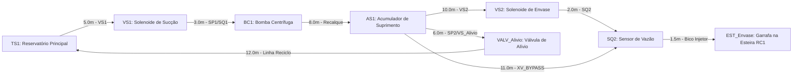

# Aula 11: Teoria dos Grafos — Modelagem da Tubulação e Instrumentos da Linha de Envase

## 1. Fundamentos Matemáticos: Definição Formal de Dígrafos Ponderados

Um **Grafo Dirigido e Ponderado (Dígrafo)** aplicado ao sistema de envasamento e dosagem de bebidas é formalmente definido pela tripla:
$$G = (V, E, W)$$

Onde:
1. **$V = \{v_1, v_2, \dots, v_n\}$** é o conjunto finito de **vértices (nós)**: reservatórios de suprimento, bombas centrífugas, acumuladores hidráulicos, válvulas de bloqueio/dosagem, sensores de vazão e bicos injetores de envase.
2. **$E \subseteq V \times V$** é o conjunto de **arestas dirigidas (arcos)** de tubulação hidráulica e linhas de reciclo com sentido de escoamento permitido do fluido.
3. **$W: E \rightarrow \mathbb{R}^+$** é a **função de ponderação**, que associa a cada duto um custo operacional (comprimento físico do tubo $L\text{ [m]}$, perda de carga distribuída $\Delta P\text{ [Barg]}$ ou tempo de trânsito hidráulico $t\text{ [s]}$).

A leitura do diagrama de fluxo sinótico acima reflete a malha da célula de dosagem do SCADA-Core: cada seta orientada representa um trecho rígido ou flexível de tubulação com sentido único de vazão imposto pelo gradiente de pressão da bomba `BC1` ou pela gravidade, e o rótulo especifica o comprimento em metros, a tag ISA-5.1 do instrumento associado e o diâmetro nominal da tubulação.

---

## 2. Por que um Grafo e não uma Lista de Equipamentos?

Em sistemas industriais de envase automatizado, as listas convencionais de instrumentos (*instrument index*) e de tubulações (*line list*) armazenam dados de maneira estática em matrizes de planilhas. A adoção formal da **estrutura de grafos** expõe propriedades topológicas determinantes para o controle em tempo real e intertravamentos de segurança (SIL/NR-12):

1. **Conectividade:** Permite verificar deterministicamente se existe rota hidráulica viável entre o Tanque Principal (`TS1`) e a Garrafa na Esteira (`EST_Envase`), detectando obstruções ou válvulas fechadas em tempo real.
2. **Redundância e Tolerância a Falhas:** Revela caminhos alternativos de dosagem. Por exemplo, a presença da linha de bypass `AS1 -> SQ2` permite manter o envase funcional mesmo em caso de falha da válvula solenoide principal `VS2`.
3. **Composição de Algoritmos:** Permite aplicar algoritmos consolidados de otimização combinatória e teoria das redes (Dijkstra, Ford-Fulkerson, BFS/DFS, Hierholzer) para diagnóstico automatizado de vazamentos, roteamento e alívio de sobrepressão.

### 2.1. Definições Fundamentais de Teoria dos Grafos

Para formalizar o modelo matemático da linha de envase, estabelecem-se as seguintes definições:

* **Ordem** do grafo: $|V| = n$, o número total de componentes discretos e nós de junção ($n = 8$).
* **Tamanho** do grafo: $|E| = m$, o número de trechos interconectados de tubulação ($m = 9$).
* **Passeio (*walk*):** uma sequência alternada de vértices e arestas $v_0, e_1, v_1, e_2, \dots, e_k, v_k$. Representa o deslocamento contínuo de uma parcela de fluido, podendo repetir dutos se houver recirculação.
* **Caminho (*path*):** um passeio sem vértices repetidos. Corresponde à trajetória direta da bebida a partir do reservatório até a garrafa final.
* **Trilha (*trail*):** um passeio sem arestas (tubulações) repetidas. Essencial para algoritmos de varredura de integridade física sem inspeção duplicada.
* **Ciclo (*cycle*):** um caminho fechado ($v_0 = v_k$) com $k \geq 1$ arestas sem repetição de nós intermediários. Na rede de envase, o ciclo `TS1 -> VS1 -> BC1 -> AS1 -> VALV_Alivio -> TS1` constitui a **malha de recirculação de segurança e alívio de pressão**.
* **Grau de saída** $\deg^+(v)$: quantidade de dutos que emergem do nó $v$ (fluxo saindo).
* **Grau de entrada** $\deg^-(v)$: quantidade de dutos que chegam ao nó $v$ (fluxo entrando).

### 2.2. Lema do Aperto de Mãos Dirigido

Para qualquer dígrafo $G = (V, E)$ representante da malha de fluidos:

$$\sum_{v \in V} \deg^+(v) = \sum_{v \in V} \deg^-(v) = |E|$$

**Justificativa Física e Topológica:** Cada tubulação $e_j = (u, v)$ parte obrigatoriamente de uma origem $u$ e chega a um destino $v$. Portanto, incrementa em $+1$ o grau de saída $\deg^+(u)$ e em $+1$ o grau de entrada $\deg^-(v)$. Esta igualdade é a regra fundamental de integridade na digitalização de diagramas P&ID: divergências na soma de graus indicam erros de cadastro no projeto (dutos desconectados ou sem término).

**Verificação na Rede da Linha de Envase:**
Somando os graus de saída ($\deg^+$): $\deg^+(\text{TS1}) + \deg^+(\text{VS1}) + \deg^+(\text{BC1}) + \deg^+(\text{AS1}) + \deg^+(\text{VS2}) + \deg^+(\text{SQ2}) + \deg^+(\text{VALV\_Alivio}) + \deg^+(\text{EST\_Envase}) = 1 + 1 + 1 + 3 + 1 + 1 + 1 + 0 = 9$.
Somando os graus de entrada ($\deg^-$): $1 + 1 + 1 + 1 + 1 + 2 + 1 + 1 = 9$. A identidade do Lema do Aperto de Mãos se confirma exatamente ($9 = 9 = |E|$).

### 2.3. Representações Computacionais e Trade-offs

| Representação | Estrutura de Dados | Custo de Espaço | Consulta de Aresta $(u,v)$ | Aplicação Recomendada |
| --- | --- | --- | --- | --- |
| **Matriz de Adjacência** | `float[n][n]` | $O(n^2)$ | $O(1)$ | Grafos densos e operações de álgebra matricial (Aula 12) |
| **Lista de Adjacência** | `dict[str, list]` | $O(n + m)$ | $O(\deg(u))$ | Grafos esparsos — ideal para navegação e buscas de rotas (Aulas 13 e 14) |
| **Matriz de Incidência** | `int[n][m]` | $O(n \cdot m)$ | — | Conservação de vazão e balanço hidráulico matricial (Aula 12) |

### 2.4. Grafo Simples vs. Multigrafo em Linhas de Envase

Se uma linha industrial de envase possuir duas tubulações físicas idênticas e em paralelo ligando o Acumulador `AS1` ao Sensor de Vazão `SQ2` para aumentar a vazão máxima de enchimento, a estrutura deixa de ser um grafo simples e se transforma em um **multigrafo**. Nesses cases, uma matriz de adjacência convencional $n \times n$ é insuficiente, exigindo listas de adjacência com suporte a múltiplas arestas ou tensores de adjacência.

---

## 3. Exemplo Resolvido

**Problema:** Na rede da linha de envase apresentada, determine a ordem $|V|$, o tamanho $|E|$, o grau de entrada e o grau de saída do Acumulador de Suprimento (`AS1`), interpretando fisicamente a relevância desses valores para o controle de pressão.

**Resolução:**
1. Ordem $|V| = 8$ (8 nós operacionais na planta).
2. Tamanho $|E| = 9$ (9 trechos de tubulação cadastrados).
3. Para o nó `AS1`:
   * Grau de entrada $\deg^-(\text{AS1}) = 1$ (recebe fluido pressurizado exclusivamente da Bomba Centrífuga `BC1`).
   * Grau de saída $\deg^+(\text{AS1}) = 3$ (distribui fluido para a linha de envase `VS2`, para a linha de alívio `VALV_Alivio` e para a linha de bypass `SQ2`).

**Interpretação Física:** O elevado grau de saída ($\deg^+ = 3$) caracteriza o nó `AS1` como um nó distribuidor de alta criticidade. A válvula de alívio associada (`VALV_Alivio`) impede surtos de pressão (*golpe de aríete*) quando a válvula de envase `VS2` fecha abruptamente após a conclusão do volume da garrafa.

---

## 4. Atividades de Investigação

1. **Topologia de Segurança:** Utilizando o Lema do Aperto de Mãos Dirigido, provar que se a linha de reciclo `VALV_Alivio -> TS1` for desativada (aresta removida), a igualdade entre a soma dos graus de entrada e saída permanece válida, mas a conectividade do ciclo de segurança é rompida.
2. **Inclusão de Linha Dupla de Bombeamento:** Suponha a adição de uma bomba reserva `BC2` em paralelo com `BC1`. Desenhe a nova topologia do grafo e determine como os graus topológicos dos nós `VS1` e `AS1` são alterados.
3. **Classificação de Rotas:** Para o deslocamento de fluido de `TS1` até `EST_Envase`, identifique um caminho simples e uma trilha que inclua a passagem pelo acumulador `AS1`.
4. **Análise de Recirculação:** Quantos ciclos simples existem no dígrafo da linha de envase caso seja adicionada uma tubulação de expurgo da Estação de Envase (`EST_Envase`) de volta ao Tanque Principal (`TS1`) para garrafas reprovadas? Enumere os vértices de cada ciclo.

---

## 5. Entregável da Aula 11

* **Classe `GrafoTubulacao` em Python:** Estrutura computacional orientada a objetos desenvolvida no Jupyter Notebook correspondente, contendo o cadastro de nós com simbologia ISA-5.1, inserção de tubulações ponderadas por comprimento/diâmetro, cálculo de graus topológicos e exportação das matrizes de adjacência.
