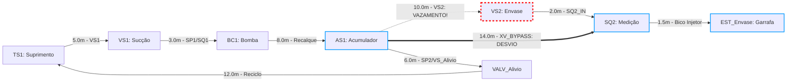

# Aula 15: Simulação de Vazamentos e Desvio Automático em Malha Fechada na Linha de Envase

## 1. Fundamentos Matemáticos: Reconfiguração Dinâmica de Grafos em Tempo Real

Na detecção de perda de estanqueidade ou vazamento em um segmento de tubulação $(u, v)$ da linha de envase, o sistema supervisório SCADA-Core executa instantaneamente a **punição topológica** na matriz de adjacência ponderada:

$$W(u, v) \leftarrow \infty, \quad \text{adj\_binaria}[u][v] \leftarrow 0$$

Em seguida, o motor algorítmico aciona o **recálculo ótimo de rota via Algoritmo de Dijkstra** para realizar a comutação automática de válvulas de bloqueio (*shut-off*) e direcionamento de fluxo para a rota redundante de contingência (*bypass*).

---

## 2. Aprofundamento Teórico

### 2.1. Grafos Dinâmicos e o Conceito de Reponderação

Um **grafo dinâmico** é modelado formalmente pela sequência temporal:

$$G_t = (V, E_t, W_t), \quad t \ge 0$$

Em contraste com as redes estáticas analisadas nas Aulas 11 a 14, as arestas e suas funções de custo variam em tempo de execução (*run-time*) em decorrência de eventos físicos na fábrica (fechamento de válvulas, rompimento de juntas, alarmes de pressão diferencial ou acionamento de intertravamentos de emergência).

A técnica de **reponderação topológica** adotada no SCADA-Core consiste em impor $W(u, v) \leftarrow \infty$ ao trecho danificado. Essa estratégia oferece vantagens determinantes em relação à remoção física da aresta na estrutura de dados:
1. **Preservação Estrutural:** Não há necessidade de reindexar nós nem redimensionar matrizes ou arrays de adjacência na memória estática do CLP ou do servidor SCADA.
2. **Histórico e Rastreabilidade:** A aresta física continua cadastrada no sistema com suas tags ISA-5.1 e propriedades mecânicas, mantendo o status `"ISOLADO_POR_FALHA"`, o que facilita auditorias de manutenção preditiva e ordens de serviço (CMMS).
3. **Eliminação de Rota sem Efeitos Colaterais:** Por definição, nenhum algoritmo de menor caminho (como Dijkstra ou Bellman-Ford) selecionará um arco com peso $\infty$, garantindo isolamento imediato da linha vazante.

### 2.2. Recomputação do Zero vs. Algoritmos Incrementais

O SCADA-Core executa a recomputação do caminho mínimo a partir do zero utilizando o Algoritmo de Dijkstra com Min-Heap binário (`heapq`), com custo computacional estrito:

$$\mathcal{O}((|V| + |E|) \log |V|)$$

Para a célula de dosagem e envase da nossa fábrica ($|V| = 8$, $|E| = 9$), essa recomputação consome menos de **0.05 milissegundos** em hardware padrão, tornando a abordagem do zero extremamente rápida, segura e isenta de corrupção de estado.

Em plantas industriais de grande escala (como malhas integradas de refinarias ou distribuição de água com $|V| > 100.000$), reprocessar Dijkstra do zero para cada evento de micro-vazamento pode sobrecarregar a CPU. Nesses contextos, a literatura de estruturas de dados avançadas prescreve **algoritmos incrementais e dinâmicos de caminhos mínimos** (*Dynamic Shortest Path Trees*, como o algoritmo de Ramalingam & Reps). Esses algoritmos mantêm a árvore de caminhos mínimos previamente computada e atualizam localmente apenas o subgrafo de vértices cujos caminhos dependiam diretamente da aresta afetada, reduzindo a complexidade média para frações do tamanho global da rede.

### 2.3. Tempo de Decisão como Métrica Crítica de Engenharia (IEC 61511 / NR-12)

O notebook desta aula mensura com precisão o tempo de decisão do algoritmo (`Tempo_Decisão_ms`) através de contadores de clock de alta precisão (`time.perf_counter()`).

Em Sistemas Instrumentados de Segurança (SIS — *Safety Instrumented Systems*) normatizados pela **IEC 61511** e **IEC 61508**, o tempo total decorrido entre a detecção do perigo e o estabelecimento do estado seguro é denominado **Tempo de Resposta de Segurança do Processo** (*Process Safety Time* — PST):

$$t_{\text{resposta\_total}} = t_{\text{detecção\_sensor}} + t_{\text{decisão\_algoritmo}} + t_{\text{atuação\_válvula}}$$

Comparando as ordens de magnitude físicas:
* $t_{\text{decisão\_algoritmo}} \approx 0.03\text{ ms a } 0.08\text{ ms}$ ($10^{-5}\text{ s}$);
* $t_{\text{atuação\_válvula}} \approx 50\text{ ms a } 300\text{ ms}$ para válvulas solenoides sanitárias de ação rápida, ou $2\text{ s a } 10\text{ s}$ para atuadores motorizados.

Essa disparidade matemática comprova que **o tempo de processamento computacional do grafo é totalmente desprezível frente à inércia mecânica dos atuadores** ($> 1.000$ vezes mais rápido). O algoritmo de desvio reage quase instantaneamente, viabilizando o intertravamento em tempo real antes que ocorra contaminação microbiológica ou perda substancial de fluido na esteira.

### 2.4. Conectividade, Pontes e Vértices de Articulação

A modelagem de vazamentos evidencia a análise de robustez topológica: **quais tubulações, se rompidas, paralisam irreversivelmente a produção?**

* **Ponte (*Bridge*):** Uma aresta $e = (u, v)$ cuja remoção estrita desconecta o grafo, aumentando o número de componentes conexos. Formalmente, $e$ é uma ponte se e somente se não pertence a nenhum ciclo simples do grafo não-dirigido subjacente.
* **Vértice de Articulação (*Cut Vertex*):** Um nó cuja remoção rompe a conectividade da rede.

Na nossa linha de envase:
1. O trecho de dosagem direta `AS1_Acumulador -> VS2_Envase` **NÃO É UMA PONTE**, pois pertence ao ciclo formado pelo acumulador, as válvulas e a linha de bypass `AS1 -> SQ2`. Sua falha é absorvida com sucesso pelo desvio automático via `XV_BYPASS`.
2. O trecho de recalque `BC1_Bomba -> AS1_Acumulador` **É UMA PONTE** para a operação de envase: se essa linha romper, nenhum fluxo atinge o acumulador ou a garrafa, tornando o custo do menor caminho $d[\text{EST\_Envase}] = \infty$.
3. Em resposta a uma falha em ponte, o SCADA-Core não apenas informa a indisponibilidade de rota, mas aciona imediatamente o protocolo de **Trip de Emergência**:
   - Desliga imediatamente a Bomba Centrífuga `BC1_Bomba`;
   - Fecha a solenoide de sucção `VS1_Succao`;
   - Abre a solenoide de despressurização `VALV_Alivio` para drenar o excesso de pressão do acumulador `AS1` de volta ao tanque `TS1_Suprimento`, eliminando riscos mecânicos (golpe de aríete e sobrepressão).

O **Algoritmo de Tarjan (1974)** permite encontrar todas as pontes e vértices de articulação em uma única busca em profundidade (DFS) com complexidade $\mathcal{O}(|V| + |E|)$, constituindo uma ferramenta preliminar indispensável para auditoria de confiabilidade da planta.

### 2.5. Resiliência de Rede e $k$-Aresta-Conectividade

Dizemos que uma sub-rede é **$k$-aresta-conexa** se a desconexão do par fonte-destino exige a remoção de no mínimo $k$ arestas independentes. Pelo **Teorema de Menger (1927)**, a conectividade por arestas entre dois vértices é igual ao número máximo de caminhos disjuntos em arestas entre eles.

Entre o Acumulador `AS1_Acumulador` e o Sensor de Medição `SQ2_Medicao`, existem dois caminhos disjuntos em arestas:
1. Rota Principal: `AS1_Acumulador -> VS2_Envase -> SQ2_Medicao`;
2. Rota de Contingência: `AS1_Acumulador -> SQ2_Medicao` (via `XV_BYPASS`).

Logo, o subsistema de envase é **2-aresta-conexo**, garantindo tolerância formal a qualquer falha singular de duto sem parada de produção.

---

## 3. Exemplo Resolvido

**Cenário:** O transmissor de pressão diferencial do acumulador $AS1$ detecta um rompimento no duto principal `AS1_Acumulador -> VS2_Envase`. Simultaneamente, a válvula manual do duto de bypass `XV_BYPASS` encontra-se indevidamente travada por bloqueio mecânico (LOTO). Determine o comportamento do algoritmo de roteamento ao recalcular a rota entre `TS1_Suprimento` e a Estação de Envase `EST_Envase`.

**Resolução Matemática e Algorítmica:**
1. O sistema impõe $W(\text{AS1\_Acumulador}, \text{VS2\_Envase}) \leftarrow \infty$.
2. Como a rota de bypass também está bloqueada, $W(\text{AS1\_Acumulador}, \text{SQ2\_Medicao}) \leftarrow \infty$.
3. Durante a execução do Algoritmo de Dijkstra:
   - Os nós `TS1_Suprimento`, `VS1_Succao`, `BC1_Bomba` e `AS1_Acumulador` são alcançados com custos $0.0$, $5.0$, $8.0$ e $16.0\,\text{m}$, respectivamente.
   - A partir de `AS1_Acumulador`, os únicos arcos de saída são para `VS2_Envase` (peso $\infty$), `SQ2_Medicao` (peso $\infty$) e `VALV_Alivio` (peso $6.0\,\text{m}$).
   - O nó `VALV_Alivio` é alcançado com custo acumulado $16.0 + 6.0 = 22.0\,\text{m}$, conduzindo de volta a `TS1_Suprimento` (custo $22.0 + 12.0 = 34.0\,\text{m}$, ciclo de recirculação fechado).
   - Não há nenhuma aresta finita conduzindo a `SQ2_Medicao` ou `EST_Envase`.
4. O algoritmo esgota a fila de prioridades Min-Heap sem conseguir relaxar a distância do destino, finalizando com:
   $$d[\text{EST\_Envase}] = \infty, \quad \text{pred}[\text{EST\_Envase}] = \text{None}$$
5. O sistema de supervisão classifica o evento como **FALHA CRÍTICA DE CONECTIVIDADE (PERDA DE TODAS AS ROTAS DISJUNTAS)** e aciona o procedimento operacional padrão `POP-ESD-01`: desligamento instantâneo do motor da bomba e interrupção do avanço da esteira transportadora $RC1$.

---

## 4. Atividades de Investigação

1. **Varredura Proativa de Pontes:** Implemente em Python uma rotina que aplique o Algoritmo de Tarjan ou teste iterativamente a reponderação de cada duto da rede padrão para $\infty$. Quais e quantas arestas da linha de envase atuam como pontes para a entrega de bebida na garrafa?
2. **Avaliação Temporal de Segurança:** Calcule a razão entre o tempo médio de decisão reportado pelo notebook ($\approx 0.05\,\text{ms}$) e o tempo de fechamento de uma válvula solenoide pneumática padrão ($120\,\text{ms}$). Como essa relação embasa o conceito de controle em tempo real determinístico?
3. **Projeto de Redundância no Recalque da Bomba:** O duto `BC1_Bomba -> AS1_Acumulador` é um ponto único de falha (*Single Point of Failure*). Proponha uma modificação no layout físico (P&ID) adicionando um duto redundante ou bomba reserva $BC2$, e demonstre graficamente como essa adição eleva a $k$-conectividade do recalque para $k = 2$.
4. **Algoritmos Incrementais em Grafos:** Pesquise sobre o algoritmo dinâmico de caminhos mínimos de Ramalingam & Reps e elabore um resumo explicando a diferença de custo amortizado entre recomputar Dijkstra integralmente versus atualizar apenas o subgrafo afetado em malhas de distribuição com milhares de nós.

---

## 5. Entregável da Aula 15

* **Módulo de Simulação de Falhas e Desvio Automático em Python (`15 - Simulação de Vazamentos e Desvio Automático.ipynb`):**
  - Implementação completa e orientada a objetos das classes `GrafoTubulacao`, `RoteadorDijkstra` e `SistemaDesvioAutomatico`.
  - Simulação de contingência com injeção programada de vazamento e desvio instantâneo via bypass.
  - Relatório em tabela ASCII demonstrando o duto isolado, a nova rota gerada, o comprimento total em metros e o tempo de decisão em frações de milissegundo.
  - Testes com asserções formais (`assert`) validando o funcionamento sem falhas.
