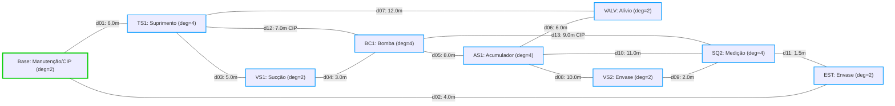

# Aula 16: Problemas Eulerianos e Inspeção Autônoma da Infraestrutura na Linha de Envase

## 1. Fundamentos Matemáticos: Teorema de Euler e Circuitos Eulerianos

Um **Circuito Euleriano** em um grafo não-dirigido conexo $G = (V, E)$ existe se e somente se **todos os vértices tiverem grau par**:

$$\forall v \in V, \quad \deg(v) \equiv 0 \pmod 2$$

Em grafos dirigidos (dígrafos), a condição análoga de eulerianidade exige conservação estrita de grau em cada nó:

$$\deg^+(v) = \deg^-(v), \quad \forall v \in V$$

Na inspeção física e sanitária da nossa linha de envase de bebidas, as tubulações são modeladas como **arestas não-dirigidas**, pois o robô autônomo de manutenção preditiva (crawler de ultrassom / PIG inteligente instrumentado) trafega livremente em ambos os sentidos da tubulação durante as paradas programadas de CIP/SIP (*Clean-in-Place* / *Sterilize-in-Place*).



---

## 2. Aprofundamento Teórico

### 2.1. Contexto Histórico: O Problema das Sete Pontes de Königsberg

A Teoria dos Grafos teve sua gênese formal em **1736**, quando Leonhard Euler solucionou o célebre enigma das sete pontes da cidade de Königsberg (atual Kaliningrado, Prússia). A questão colocada pelos cidadãos era se seria possível realizar um passeio contínuo a pé que atravessasse cada uma das sete pontes sobre o rio Pregel exatamente uma vez, retornando ao ponto de partida.

Euler abstraiu a geografia em terra firme (vértices) e pontes (arestas), demonstrando matematicamente que tal passeio era **impossível**, uma vez que todas as quatro massas de terra possuíam número ímpar de pontes conectadas.

Na engenharia de controle e automação contemporânea, aplicamos exatamente o mesmo princípio para resolver um problema operacional de alta relevância: **como inspecionar 100% dos dutos de transporte de fluidos da fábrica sem que o robô repita passagens desnecessárias**, minimizando tempo de linha parada (*downtime*), consumo de bateria e desgaste dos sensores de espessura de parede.

### 2.2. Definição Formal e Prova do Teorema de Euler

**Teorema (Euler, 1736):** Seja $G = (V, E)$ um multigrafo finito, conexo e não-nulo. $G$ admite um circuito euleriano se e somente se todo vértice $v \in V$ tem grau par ($\deg(v)$ é par).

#### Prova de Necessidade ($\implies$):
Suponha que $G$ possui um circuito euleriano $C = (v_0, e_1, v_1, \dots, e_m, v_0)$. Cada ocorrência de um vértice intermediário $v$ no circuito consome uma aresta para "entrar" em $v$ e outra para "sair" de $v$. Portanto, cada passagem por $v$ contribui com $+2$ para o grau de $v$. Como $C$ é um circuito fechado ($v_0 = v_m$), o vértice inicial/final também tem sua aresta de partida emparelhada com sua aresta de chegada final. Como todas as arestas de $G$ pertencem a $C$ exatamente uma vez, o grau de todo vértice deve ser estritamente par.

#### Prova de Suficiência ($\impliedby$, Esboço Construtivo):
Se todo vértice tem grau par e o grafo é conexo:
1. Partindo de qualquer nó $u$, construímos um passeio sem repetir arestas. Como todo nó tem grau par, sempre que o percurso entra em um nó por uma aresta não visitada, resta um número ímpar de arestas disponíveis para sair dele. O único nó onde o percurso pode terminar preso sem saída é o nó inicial $u$ ao completar um ciclo fechado $C_1$.
2. Se $C_1$ não cobrir todas as arestas de $E$, removemos as arestas de $C_1$ de $G$. O subgrafo residual $G' = G \setminus E(C_1)$ ainda tem todos os graus pares. Pela conexidade de $G$, existe ao menos um vértice $w$ compartilhado entre $C_1$ e uma componente não-trivial de $G'$.
3. Construímos um novo ciclo fechado $C_2$ em $G'$ a partir de $w$ e "costuramos" $C_2$ dentro de $C_1$ no nó de junção $w$.
4. Como o conjunto de arestas é finito, a repetição sucessiva desse procedimento esgota todas as arestas de $E$, resultando em um único circuito euleriano completo. $\blacksquare$

Essa demonstração construtiva é a base exata do **Algoritmo de Hierholzer (1873)**.

### 2.3. Topologia da Malha Sanitária da Linha de Envase

Na nossa linha de envase, o sistema hidráulico opera sob rígidos padrões sanitários (aço inoxidável AISI 316L polido). A malha de inspeção física é composta por 9 vértices operacionais interligados por 13 trechos de tubulação:

| Vértice / Equipamento | Dutos Incidentes | Grau $\deg(v)$ | Paridade | Função no Skid |
| :--- | :--- | :---: | :---: | :--- |
| `Base_Manutencao` | $d_{01}, d_{02}$ | **2** | Par | Estação de Recarga do Robô / Skid CIP |
| `TS1_Suprimento` | $d_{01}, d_{03}, d_{07}, d_{12}$ | **4** | Par | Reservatório Principal de Bebida |
| `VS1_Succao` | $d_{03}, d_{04}$ | **2** | Par | Válvula Solenoide de Sucção |
| `BC1_Bomba` | $d_{04}, d_{05}, d_{12}, d_{13}$ | **4** | Par | Bomba Centrífuga de Recalque |
| `AS1_Acumulador` | $d_{05}, d_{06}, d_{08}, d_{10}$ | **4** | Par | Acumulador Hidráulico / Pulmão |
| `VS2_Envase` | $d_{08}, d_{09}$ | **2** | Par | Válvula Solenoide de Enchimento |
| `SQ2_Medicao` | $d_{09}, d_{10}, d_{11}, d_{13}$ | **4** | Par | Sensor de Vazão Eletromagnético |
| `EST_Envase` | $d_{02}, d_{11}$ | **2** | Par | Bico Injetor / Garrafa na Esteira |
| `VALV_Alivio` | $d_{06}, d_{07}$ | **2** | Par | Válvula de Alívio e Linha de Reciclo |

Todos os 9 vértices possuem graus estritamente pares ($\deg(v) \in \{2, 4\}$). Consequentemente, a malha satisfaz com precisão a condição necessária e suficiente de Euler.

### 2.4. O Algoritmo de Hierholzer — Análise Detalhada

O algoritmo de Hierholzer é a ferramenta computacional ótima para gerar o circuito euleriano. Sua implementação utiliza uma **pilha explícita com remoção de arestas percorridas**:

```
Entrada: Grafo não-dirigido G com todos os graus pares, vértice inicial v_inicio
Saída: Sequência ordenada de vértices do circuito euleriano

1. pilha <- [v_inicio]
2. circuito <- []
3. Enquanto pilha não estiver vazia:
4.     u <- topo(pilha)
5.     Se u possui vizinhos em adj[u]:
6.         Selecione uma aresta e = (u, v)
7.         Remova e de adj[u] e de adj[v]
8.         Empilhe v
9.     Senão:
10.        circuito.anexar(desempilhar(pilha))
11. Retorne inverter(circuito)
```

**Complexidade Computacional:**
* Cada aresta $e \in E$ é percorrida e removida de ambas as listas de adjacência exatamente uma vez: tempo $\mathcal{O}(|E|)$.
* Cada vértice é empilhado e desempilhado um número de vezes proporcional ao seu grau: $\sum_{v} \deg(v) = 2|E| = \mathcal{O}(|E|)$.
* O custo temporal total é **estritamente linear**: $\mathcal{O}(|E|)$. Trata-se da complexidade teórica assintoticamente ótima para qualquer algoritmo de inspeção total.

### 2.5. O Problema do Carteiro Chinês (*Chinese Postman Problem*)

Em expansões industriais ou skids assimétricos, é comum que a adição de novos instrumentos de purga ou amostragem resulte em nós de **grau ímpar**. Nesses cenários, não existe um circuito euleriano perfeito sem repetição.

O problema de encontrar o percurso fechado de menor custo que passe por todas as arestas pelo menos uma vez é denominado **Problema do Carteiro Chinês** (*Chinese Postman Problem* — Kwan Mei-Ko, 1962).

A solução ótima é obtida em tempo polinomial através de 4 etapas formais:
1. **Identificação dos Vértices Ímpares:** Identifica-se o conjunto $V_{\text{impar}} = \{v \in V \mid \deg(v) \text{ é ímpar}\}$. Pelo Lema do Aperto de Mãos, $|V_{\text{impar}}|$ é sempre par.
2. **Cálculo de Menores Caminhos:** Computam-se as distâncias mínimas entre todos os pares de vértices ímpares utilizando o Algoritmo de Dijkstra da Aula 14.
3. **Emparelhamento de Peso Mínimo (*Minimum Weight Perfect Matching*):** Encontra-se a partição de $V_{\text{impar}}$ em pares de menor soma de distâncias totais utilizando o **Algoritmo de Blossom (Edmonds, 1965)**, com complexidade $\mathcal{O}(|V|^3)$.
4. **Duplicação de Arestas e Execução de Hierholzer:** Duplicam-se na malha as arestas correspondentes aos menores caminhos do emparelhamento mínimo. O multigrafo resultante passa a ter todos os vértices com grau par, permitindo a aplicação direta do Algoritmo de Hierholzer em $\mathcal{O}(|E|)$.

### 2.6. Normas Regulatórias e Segurança Alimentar

Na indústria de envase de bebidas, as rotas de inspeção autônoma atendem a requisitos das normas **ANVISA RDC 275/2002** (Procedimentos Operacionais Padronizados na Indústria de Alimentos), **FDA 21 CFR Part 117** e diretrizes da **3-A Sanitary Standards**:
* A inspeção por ultrassom deve garantir espessura residual mínima de parede em curvas e conexões triclamp, prevenindo furos que gerem contaminação biológica.
* O percurso ótimo euleriano assegura que nenhuma tubulação da célula de dosagem permaneça sem auditoria de integridade física.

---

## 3. Exemplo Resolvido

**Problema:** Na malha de inspeção sanitária apresentada, determine a soma total dos graus dos vértices, verifique a identidade do Lema do Aperto de Mãos Não-Dirigido e calcule o número total de trechos inspecionados.

**Resolução:**
1. A soma dos graus dos vértices é:
   $$\sum_{v \in V} \deg(v) = \deg(\text{Base}) + \deg(\text{TS1}) + \deg(\text{VS1}) + \deg(\text{BC1}) + \deg(\text{AS1}) + \deg(\text{VS2}) + \deg(\text{SQ2}) + \deg(\text{EST}) + \deg(\text{VALV})$$
   $$\sum_{v \in V} \deg(v) = 2 + 4 + 2 + 4 + 4 + 2 + 4 + 2 + 2 = 26$$
2. Pelo Lema do Aperto de Mãos Não-Dirigido:
   $$\sum_{v \in V} \deg(v) = 2 |E| \implies 26 = 2 |E| \implies |E| = 13\text{ dutos}$$
3. Como todos os 9 graus são pares e o grafo é conexo, a rede é **Euleriana**.
4. Executando o Algoritmo de Hierholzer partindo de `Base_Manutencao`, o robô percorre exatamente 13 passos de aresta, visitando 14 vértices na sequência do circuito fechado e inspecionando $100\%$ da tubulação do skid com custo redundante nulo.

---

## 4. Atividades de Investigação

1. **Alteração Topológica e Violação de Paridade:** Suponha a adição de um duto direto de purga conectando `VS1_Succao` a `VS2_Envase`. Calcule os novos graus desses dois vértices e mostre que o grafo deixa de ser Euleriano.
2. **Aplicação do Problema do Carteiro Chinês:** Para o grafo com a alteração da Atividade 1, aplique o roteiro do Carteiro Chinês: qual caminho mínimo entre os dois vértices de grau ímpar deve ter suas arestas duplicadas para restaurar a eulerianidade ao menor custo possível?
3. **Invariância de Comprimento em Hierholzer:** Se o algoritmo de Hierholzer for iniciado em `TS1_Suprimento` em vez de `Base_Manutencao`, o comprimento total percorrido é alterado? Justifique matematicamente.
4. **Inspeção de Dutos em Malhas Dirigidas:** Se a inspeção devesse ser realizada com o processo em operação contínua (com fluxo de fluido forçado em sentido único), determine se o dígrafo original da Aula 11 é euleriano comparando $\deg^+(v)$ e $\deg^-(v)$ para cada equipamento.

---

## 5. Entregável da Aula 16

* **Módulo de Inspeção Euleriana de Tubulações em Python (`16 - Problemas Eulerianos e Inspeção de Infraestrutura.ipynb`):**
  - Implementação da classe `GrafoInspecaoEuleriano` contendo os métodos `adicionar_duto`, `obter_graus`, `verificar_euleriano` e `calcular_circuito_hierholzer`.
  - Construção da malha sanitária de 13 tubulações do skid de envase de bebidas.
  - Tabela formatada em ASCII com a auditoria de graus de todos os equipamentos.
  - Sequência completa da rota de inspeção autônoma do robô industrial sem repetição de trechos.
  - Bateria de testes formais (`assert`) validando o cumprimento do Teorema de Euler e a cobertura de 100% dos dutos.
